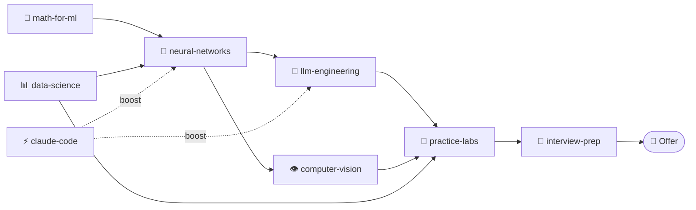

<!-- visual-map -->
## 🗺️ Visual map

If you prefer pictures to walls of text, open [**roadmap-diagrams.md**](./roadmap-diagrams.md) — 10 Mermaid diagrams covering the full repo: course dependencies, track decision tree, LLM application stack, RAG sequence, CV pipeline, MLOps lifecycle, career path, and more.

Full set of diagrams → [roadmap-diagrams.md](./roadmap-diagrams.md)

---

# 🤖 Machine Learning Roadmap: from zero to vibe-coding guru

> **A learning map for Machine Learning, Deep Learning, LLMs, Generative AI, and MLOps** — from your first `import numpy` to the level of an engineer who understands **how AI works inside** and can build production systems, not just call APIs.

**Keywords:** machine learning, deep learning, ML roadmap, LLM, neural networks, PyTorch, transformers, RAG, AI agents, MLOps, fine-tuning, prompt engineering, vibe coding, generative AI, Hugging Face, data scientist, ML engineer, how to become an ML engineer, learn machine learning from scratch.

---

The leading Russian-language channel on ML/AI/Big Data — [**@ai_machinelearning_big_data**](https://t.me/+vgdHgaV7FuVmOTIy). Model releases the day they ship, plain-language paper breakdowns from arXiv, ready-to-run code, production cases, jobs, and benchmarks. If you only subscribe to one AI resource — make it this one.

---

## 🗺️ Visual map

If you prefer pictures to walls of text, open [**roadmap-diagrams.md**](./roadmap-diagrams.md) — 10 Mermaid diagrams covering the full repo: course dependencies, track decision tree, LLM stack, RAG sequence, CV pipeline, MLOps lifecycle, career path, and more.

Full set of diagrams → [roadmap-diagrams.md](./roadmap-diagrams.md)

## ⚡ Quick start: what to do this week

If you just landed here and don't know where to start — here are exactly 7 steps for the next 7 days. Without them, nothing else in this roadmap will work.

1. **Install Python 3.12+, VS Code (or Cursor), and Git.** 30 minutes.
2. **Create a GitHub account and a repository named `ml-journey`.** All your learning projects will live there. 15 minutes.
3. **Sign up for [Kaggle](https://www.kaggle.com)** and complete [Intro to Machine Learning](https://www.kaggle.com/learn/intro-to-machine-learning) (4 hours, free).
4. **Subscribe to 3 channels from the list below** — `@ai_machinelearning_big_data` plus 2 of your choice.
5. **Open a Colab notebook** and run your first `import torch; torch.tensor([1,2,3])`. This kills the fear.
6. **Block 10 hours per week in your calendar** — specific time slots, not "whenever I can".
7. **Tell someone you're learning ML.** A social network, a friend, a chat. A public commitment works.

> 💡 If you've done these 7 steps — congratulations, you're already ahead of 80% of the people who "plan to learn ML".

---

## 👥 If you are… (3 typical starting points)

**🧑‍💻 If you're a developer (2+ years of experience):**
Skip Python, jump straight into math (if you haven't covered it) and classical ML. Your advantage — you already write production code. Your strong card at interviews is MLOps and model integration. Target position in 6 months: **ML Engineer**, not Data Scientist.

**🧑‍🎓 If you're a student or changing careers:**
Follow the roadmap sequentially. Don't rush — give it 12 months. The main thing is your portfolio and Kaggle submissions. Target position: **Junior Data Scientist / ML Engineer**. An internship during your studies is almost mandatory.

**🔬 If you come from science/analytics (physics, biology, economics):**
You already have math and data-handling skills — that's a huge plus. Learn Python and the engineering side (Git, Docker, FastAPI). Your niche is **Research Engineer / Applied Scientist**: positions where you get paid for deep understanding of models, not for "vibe-coding an endpoint".

---

## 🪞 Honest expectations: what infomercial courses won't tell you

Before you commit to a year of learning, read this. These 7 things will save you months of disappointment.

1. **"ML in 3 months" is marketing.** A realistic path to a confident junior level is 9–18 months of systematic practice. To a mid-level — another 1.5–2 years. Anyone promising faster is selling a dream.

2. **80% of the work isn't models.** It's data, ETL, SQL, arguing with product, documentation, and bugs. If you only love "training neural networks" — you'll be miserable in production.

3. **Hype ≠ jobs.** The majority of openings aren't GPT agents — they're tabular ML, recommendations, classification, regression. More boring than Twitter, but that's what pays.

4. **You need less math than theorists think, and more than practitioners want.** No PhD-level calculus required. You need live intuitions about gradients, probability, linear algebra. Without them you're just a "library operator".

5. **Portfolio beats a diploma.** Nobody cares about your Coursera certificate. They care about what's on your GitHub and what you can explain in an interview.

6. **LLMs don't turn juniors into seniors.** They make juniors **more productive**, but humans make decisions. Without understanding fundamentals, you become a "Copilot Tab presser" — the first thing they'll automate.

7. **Burnout is real.** ML is a marathon with lots of rejections, dead ends, and rewrites. Without sleep, sports, and rest, you'll burn out in 6–12 months and lose a year.

> 🎯 The good news: if you know all this in advance — the path becomes **simpler and more predictable** than for people who believe the hype.

---

## 🎯 TL;DR

This roadmap isn't "a list of courses for a year". It's **a map of the terrain** along which you chart your own route. The goal isn't to "complete a course", but to **be able to do**: train models, deploy inference, build RAG, fine-tune LLMs, monitor production, understand papers, and read other people's code.

Time guideline at ~10–15 hours per week:

- **0–3 months:** Python + math + classical ML → first models on tabular data.
- **3–6 months:** Deep Learning, CV, NLP → your own neural networks in PyTorch.
- **6–12 months:** LLM, transformers, RAG, fine-tuning, AI agents → applied projects.
- **12+ months:** MLOps, production, scaling, specialization → junior → mid-level in real work.

---

## 🧭 5 survival rules

1. **More code than theory.** Every topic closes with an artifact: a notebook, a repo, a demo.
2. **Don't learn everything at once.** One track at a time. PyTorch **or** TensorFlow. LangChain **or** LlamaIndex. The other one later.
3. **Reproduce papers by hand.** Read → implement a simplified version → understand. Without this, you don't know the paper.
4. **Build a portfolio from month one.** GitHub, Hugging Face, a tech blog. Without a portfolio, nobody hires you even as a junior.
5. **The metric matters more than the model.** First figure out how to measure success, then train. Otherwise you're optimizing noise.

---

## 🗺️ Structure: 7 tracks

| # | Track | What you'll master | Duration |
|---|------|-------------|--------------|
| 1 | **Foundation** | Python, math, statistics, tools | 4–6 weeks |
| 2 | **Classical ML** | scikit-learn, tabular data, metrics, validation | 4–6 weeks |
| 3 | **Deep Learning** | PyTorch, NN, CV, NLP, training loop | 6–8 weeks |
| 4 | **LLMs and transformers** | GPT internals, fine-tuning, RAG, agents | 6–10 weeks |
| 5 | **Generative AI** | Diffusion, multimodality, prompt engineering | 4–6 weeks |
| 6 | **MLOps and production** | Docker, K8s, CI/CD, monitoring, vLLM, serving | 4–6 weeks |
| 7 | **Specialization** | CV / NLP / RecSys / RL / Safety — your pick | 8+ weeks |

---

## 🧱 Track 1 — Foundation (Python + math)

**Goal:** stop being afraid of formulas and learn to write code other people can read.

**Topics:** Python (types, functions, classes, dataclasses, generators, async/await, type hints); data stack (numpy, pandas, polars, matplotlib, seaborn, plotly); math (linear algebra, derivatives, gradients, chain rule); probability and statistics (distributions, CLT, MLE, CIs, A/B tests, p-value); tools (Jupyter, VS Code, Git, GitHub, virtual envs via uv/poetry/conda).

**Artifact:** an EDA notebook on a real dataset (Kaggle / Open Data) + a short report.

**You're ready when:** you can explain correlation vs causation, don't confuse `loc` and `iloc`, and know what a gradient is.

---

## 📊 Track 2 — Classical ML

**Goal:** learn to solve problems without neural networks. The majority of real industry tasks are tabular data.

**Topics:** data prep (missing values, outliers, feature engineering, encoding, scaling); algorithms (linear/logistic regression, KNN, decision trees, Random Forest, **gradient boosting: XGBoost, LightGBM, CatBoost**); clustering and dimensionality reduction (K-Means, DBSCAN, PCA, t-SNE, UMAP); metrics (precision/recall/F1, ROC-AUC, PR-AUC, MAE/RMSE, MAPE — **and when to use which**); validation (train/val/test, K-Fold, stratified, time-series split, data leakage); interpretability (feature importance, SHAP, partial dependence).

**Artifact:** an end-to-end Kaggle competition (Titanic doesn't count). Finish with a report on metrics, errors, and improvement ideas.

**You're ready when:** you understand why ROC-AUC can mislead on imbalanced data, know what data leakage is and 3 ways to catch it, and can explain why gradient boosting beats neural nets on tabular data.

---

## 🧠 Track 3 — Deep Learning

**Goal:** stop seeing neural networks as a black box. Be able to write a training loop from scratch.

**Topics:** PyTorch (tensors, autograd, nn.Module, DataLoader, optimizer, loss); basic networks (MLP, CNN, RNN/LSTM/GRU); training loop (train/eval, checkpoints, early stopping, LR scheduler); regularization (dropout, weight decay, batch norm, layer norm, augmentation); optimizers (SGD, momentum, Adam, AdamW, warmup); CV (ResNet, EfficientNet, transfer learning, fine-tuning); pre-transformer NLP (word2vec, GloVe, embeddings, seq2seq).

**Artifact:** **mini-GPT (~10M parameters) from scratch in PyTorch** + benchmark against `torch.nn.MultiheadAttention`. This closes attention for good.

**You're ready when:** you can write a training loop from scratch, know why vanishing gradients break deep nets, and understand batch norm vs layer norm.

---

## 🚀 Track 4 — LLMs and transformers

**Goal:** understand how GPT-like models work **inside** and be able to apply them in production.

**Topics:**

- **Transformer architecture:** attention, self-attention, multi-head, positional encoding (sinusoidal, RoPE, ALiBi).
- **Internals:** KV-cache, MQA/GQA, FlashAttention, speculative decoding, continuous batching, paged attention (vLLM).
- **Tokenization:** BPE, WordPiece, SentencePiece. Why `tiktoken` matters.
- **Pre-training → SFT → RLHF/DPO:** how "reading the internet" turns into ChatGPT.
- **Prompt engineering:** few-shot, chain-of-thought, ReAct, structured output (JSON mode, function calling).
- **RAG:** chunking, embeddings, vector DB (Qdrant, Weaviate, pgvector), re-ranking, hybrid search.
- **Fine-tuning:** LoRA, QLoRA, PEFT, DPO. When to fine-tune vs when a prompt is enough.
- **AI agents:** ReAct, tool use, function calling, MCP (Model Context Protocol), multi-agent.

**Artifact:** **your own RAG service** over a document corpus + fine-tuning an open-source model (Llama / Qwen / Mistral 7B) via LoRA on your own dataset.

**You're ready when:** you can explain KV-cache, understand PPO vs DPO, and know when RAG beats fine-tuning.

---

## 🎨 Track 5 — Generative AI and multimodality

**Goal:** be able to generate images, video, audio — and understand how it works.

**Topics:** Diffusion models (DDPM, DDIM, Latent Diffusion, Flow Matching, DiT); generation control (classifier-free guidance, ControlNet, LoRA for diffusion, IP-Adapter); VLMs (CLIP, BLIP, LLaVA, Qwen-VL, native multimodal like Gemini, GPT-4o); audio (Whisper, TTS, voice cloning); prompt engineering for generative AI.

**Artifact:** your own Stable Diffusion XL fine-tuned via LoRA on your own dataset + a Gradio demo on Hugging Face Spaces.

---

## ⚙️ Track 6 — MLOps and production

**Goal:** ship a model to production without waking up the on-call engineer at 3 AM.

**Topics:** Docker, docker-compose, multi-stage builds; Kubernetes (pods, services, deployments, HPA, Helm); CI/CD (GitHub Actions, model tests, automated deployment); serving (**vLLM**, **TGI**, **TensorRT-LLM**, **llama.cpp**, **Ollama** for LLMs; BentoML, Ray Serve for classics); monitoring (quality metrics, drift detection, latency, tokens/sec — Evidently, Grafana + Prometheus); experiments (**W&B**, **MLflow**, **DVC**); LLM observability (**LangSmith**, **Langfuse**, **Arize Phoenix**).

**Artifact:** your own LLM service in Docker → Kubernetes → with autoscaling, monitoring, and health checks. Metrics: tokens/sec, p99 latency, error rate.

---

## 🎯 Track 7 — Specialization (pick 1–2)

By this point you have the foundation. From here on — **depth** in one area:

- **NLP / LLM Engineer** — fine-tuning, RAG in production, agents, LLM evaluation.
- **Computer Vision** — detection, segmentation, diffusion, video, 3D, medical CV.
- **Recommender Systems** — collaborative filtering, two-tower, rankers, RecSys in production.
- **Reinforcement Learning** — Q-learning, policy gradients, PPO, RLHF, agents in environments.
- **AI Safety / Alignment** — red-teaming, evaluation, interpretability, guardrails.
- **MLOps / Platform** — infrastructure for an ML team, GPU orchestration, feature stores.

---

## 📐 Levels: junior → middle → senior → guru

| Level | What they can do |
|---------|-----------|
| **Junior ML** | Solves tabular problems, trains CNNs on ready datasets, understands metrics, reads notebooks. |
| **Middle ML** | Writes a training loop from scratch, fine-tunes LLMs, builds RAG, understands evaluation, ships to production. |
| **Senior ML / LLM Engineer** | ML system architecture, model and infrastructure choices, mentoring, research direction calls. |
| **Guru / Vibe coder with understanding** | Explains how FlashAttention works; implements DPO, speculative decoding, custom kernels. Writes papers / open source. |

---

## 📺 Useful Telegram channels (read daily)

A curated list of channels that genuinely help you keep your finger on the industry's pulse: fresh papers, model releases, architecture breakdowns, jobs, and interviews.

### 🤖 Machine Learning, Neural Networks, and LLMs

- **[@ai_machinelearning_big_data](https://t.me/ai_machinelearning_big_data)** — **the leading Russian-language channel on ML/AI/Big Data**. Fresh papers, model releases, breakdowns.
- **[Data Analysis / ML](https://t.me/data_analysis_ml)** — data analytics and ML without fluff: tutorials, libraries, cases.
- **[Вистехно](https://t.me/vistehno)** — about technology, AI, and engineering culture.
- **[Machine Learning Interview](https://t.me/machinelearning_interview)** — problems, interview breakdowns, and theoretical ML questions.
- **[Data Science / IoT](https://t.me/datascienceiot)** — Data Science, industrial applications, and IoT.
- **[Artificial Intelligence / DL](https://t.me/ArtificialIntelligencedl)** — deep learning and AI paper reviews.
- **[Machine Learning Test](https://t.me/Machinelearningtest)** — tests, mini-tasks, ML knowledge checks.
- **[Machine Learning](https://t.me/machinee_learning)** — English-language news and ML materials.
- **[Machine Learning RU](https://t.me/machinelearning_ru)** — Russian-language ML channel, articles, tooling.
- **[Neural Networks](https://t.me/neural)** — about neural networks, architectures, and applications.
- **[Machine Learning Rus](https://t.me/machinelearning_rus)** — ML materials in Russian, breakdowns and curated lists.
- **[Big Data AI](https://t.me/bigdatai)** — Big Data, analytics, and AI tools.
- **[@ai_generative](https://t.me/ai_generative)** — generative AI: LLMs, diffusion models, image/video/audio generation.

### 📚 Books, Databases, and SQL

- **[Machine Learning Books](https://t.me/machinelearning_books)** — books, guides, and learning materials for ML/AI.
- **[SQL Hub](https://t.me/sqlhub)** — SQL, query optimization, and relational DB work.
- **[Databases](https://t.me/databases_tg)** — about databases: relational, NoSQL, analytical.

### 💼 Jobs and Career

- **[Data Science / ML Jobs](https://t.me/datascienceml_jobs)** — Data Science and ML openings, remote and on-site.
- **[Machine Learning Jobs](https://t.me/Machinelearning_Jobs)** — a dedicated ML jobs feed: junior, middle, senior, research.

### 📁 Folders and bulk subscription

- **[📁 Big folder of ML/AI channels](https://t.me/addlist/u15AMycxRMowZmRi)** — a curated collection of the best channels on ML, neural networks, LLMs, and MLOps.

> 💡 Tip: don't subscribe to 200 channels. Take 5–7 key ones, read them 15 minutes a day — that's enough to stay current.

---

## 🆓 Best free courses on ML / DL / LLM

This list alone is enough to become an ML engineer without spending a dime. The key is to **finish what you start** and do the homework.

### 🟢 Start: math and Python

- **[Khan Academy — Linear Algebra / Calculus / Probability](https://www.khanacademy.org/math)** — free, accessible, ideal for entry.
- **[3Blue1Brown — Essence of Linear Algebra / Neural Networks](https://www.3blue1brown.com/)** — visual, intuitive videos. Mandatory.
- **[CS50P — Introduction to Python (Harvard)](https://cs50.harvard.edu/python/)** — the best intro to Python.

### 🟡 Classical ML

- **[Andrew Ng — Machine Learning Specialization (Coursera)](https://www.coursera.org/specializations/machine-learning-introduction)** — the classic, audit for free.
- **[StatQuest with Josh Starmer (YouTube)](https://www.youtube.com/@statquest)** — ML and statistics explained with songs. The best channel for building intuition.
- **[Open Machine Learning Course (mlcourse.ai)](https://mlcourse.ai/)** — a thorough open ML course with assignments.
- **[Google Machine Learning Crash Course](https://developers.google.com/machine-learning/crash-course)** — Google's free intro to ML with hands-on exercises.

### 🔴 Deep Learning

- **[fast.ai — Practical Deep Learning for Coders](https://course.fast.ai/)** — top-down approach: first it works, then we understand.
- **[Andrew Ng — Deep Learning Specialization (Coursera)](https://www.coursera.org/specializations/deep-learning)** — the foundation.
- **[Andrej Karpathy — Neural Networks: Zero to Hero (YouTube)](https://karpathy.ai/zero-to-hero.html)** — **mandatory viewing**. From `micrograd` to `nanoGPT` with your own hands.
- **[CS231n — Stanford CV](http://cs231n.stanford.edu/)** — the classic computer vision course.
- **[Dive into Deep Learning (d2l.ai)](https://d2l.ai/)** — a free interactive textbook with code.
- **[NYU Deep Learning (Yann LeCun)](https://atcold.github.io/NYU-DLSP21/)** — Yann LeCun's full DL course at NYU. Free on YouTube.

### 🟣 LLMs, transformers, and Generative AI

- **[Hugging Face — NLP Course](https://huggingface.co/learn/nlp-course)** — the official course on working with transformers via the Transformers library.
- **[Hugging Face — Deep RL Course](https://huggingface.co/learn/deep-rl-course)** — RL with practice.
- **[Hugging Face — Diffusion Models Course](https://huggingface.co/learn/diffusion-course)** — how Stable Diffusion and Flux work.
- **[Hugging Face — Audio Course](https://huggingface.co/learn/audio-course)** — Whisper, TTS, audio processing.
- **[Hugging Face — Agents Course](https://huggingface.co/learn/agents-course)** — the official course on AI agents, smolagents, LangGraph.
- **[DeepLearning.AI — Short Courses](https://www.deeplearning.ai/short-courses/)** — dozens of free short courses from Andrew Ng in partnership with OpenAI, Anthropic, LangChain, LlamaIndex.
- **[Full Stack Deep Learning — LLM Bootcamp](https://fullstackdeeplearning.com/llm-bootcamp/)** — a two-day bootcamp on building LLM apps. Free on YouTube.
- **[Stanford CS25 — Transformers United](https://web.stanford.edu/class/cs25/)** — guest lectures from authors of major transformer papers.
- **[Maxime Labonne — LLM Course (GitHub)](https://github.com/mlabonne/llm-course)** — a structured LLM roadmap with notebooks for fine-tuning, quantization, evaluation.

### 🟠 Prompt engineering, RAG, AI agents

- **[Anthropic — Prompt Engineering Interactive Tutorial](https://github.com/anthropics/prompt-eng-interactive-tutorial)** — the official tutorial from Anthropic on working with Claude.
- **[Anthropic — Courses (GitHub)](https://github.com/anthropics/courses)** — a full set of free courses: API Fundamentals, Prompt Engineering, Tool Use, MCP.
- **[OpenAI Cookbook](https://cookbook.openai.com/)** — hundreds of working examples from OpenAI.
- **[Microsoft — Generative AI for Beginners](https://github.com/microsoft/generative-ai-for-beginners)** — 21 lessons with code on building GenAI apps.
- **[Microsoft — AI Agents for Beginners](https://github.com/microsoft/ai-agents-for-beginners)** — Microsoft's official course on AI agents.
- **[LangChain Academy](https://academy.langchain.com/)** — free courses on LangChain and LangGraph.
- **[Prompt Engineering Guide (DAIR.AI)](https://www.promptingguide.ai/)** — a consolidated catalog of prompting techniques.

### 🟤 MLOps, production, and infrastructure

- **[Made With ML — MLOps Course](https://madewithml.com/courses/mlops/)** — a full course on getting ML to production. Free.
- **[Full Stack Deep Learning](https://fullstackdeeplearning.com/)** — production ML from Berkeley. All lectures on YouTube.
- **[MLOps Zoomcamp (DataTalks.Club)](https://github.com/DataTalksClub/mlops-zoomcamp)** — a practical MLOps bootcamp. Free, with homework.
- **[MLE for Production (MLOps) Specialization](https://www.coursera.org/specializations/machine-learning-engineering-for-production-mlops)** — Andrew Ng + Robert Crowe, free audit.
- **[Chip Huyen's ML interviews book](https://huyenchip.com/ml-interviews-book/)** — free materials from the author of the seminal book on ML systems.

### ⚫ Reinforcement Learning and advanced topics

- **[David Silver — Reinforcement Learning Course (DeepMind, UCL)](https://www.davidsilver.uk/teaching/)** — the classic RL course from the author of AlphaGo.
- **[Spinning Up in Deep RL (OpenAI)](https://spinningup.openai.com/)** — the official intro to Deep RL from OpenAI.

> 🎯 **How to use this list:** don't try to do it all. Pick 1 course from each block relevant to your current track. Finish it — with homework and a project. Then come back for the next one.

---

## 🧠 Advanced topics (deep dive)

This block isn't a "mandatory curriculum" but a map of **specializations**. Pick 1–2 directions after track 5–6 and go deep enough that you can write your own implementations.

### 🔴 Transformer internals: from math to CUDA

- **What a "vibe-coding guru" should explain:** why attention is soft k-NN, what KV-cache is and why it breaks on long contexts, MHA/MQA/GQA differences, why RoPE/ALiBi/YaRN were invented, what FlashAttention (1/2/3) is, how speculative decoding/continuous batching/paged attention (vLLM) work.
- **Artifact:** mini-GPT (~10M params) from scratch in PyTorch + benchmark against `torch.nn.MultiheadAttention`.
- **Resources:** Karpathy nanoGPT and build-nanogpt, Attention Is All You Need, GPT-2/3/4 tech reports, Lilian Weng's blog.

### 🔴 Alignment, RLHF, DPO, and LLM post-training

- **Topics:** SFT → Reward Modeling → PPO/RLHF → DPO/IPO/KTO → Constitutional AI → RLAIF.
- **Understand:** why SFT alone isn't enough for chat models, math behind PPO vs DPO, reward hacking/sycophancy/mode collapse after RLHF.
- **Artifact:** fine-tune Llama / Qwen / Mistral 7B via LoRA + DPO on your own dataset, compare metrics.
- **Resources:** InstructGPT, DPO (Rafailov et al.), Anthropic Constitutional AI, libs `trl`, `axolotl`, `unsloth`.

### 🔴 Diffusion models and image/video generation

- **Topics:** DDPM → DDIM → Score-based → Latent Diffusion → Flow Matching → Rectified Flow → DiT (Sora-like).
- **Understand:** forward/backward process, classifier-free guidance, ControlNet, LoRA for diffusion, IP-Adapter.
- **Artifact:** DDPM on MNIST/CIFAR from scratch + fine-tune SDXL via LoRA on your own dataset.
- **Resources:** fast.ai Part 2, DDPM/LDM/DiT papers, Sander Dieleman's blog.

### 🔴 Multimodality and VLMs

- **Topics:** CLIP → BLIP/BLIP-2 → LLaVA → Qwen-VL → GPT-4V → native multimodal (Gemini, GPT-4o).
- **Understand:** how an image becomes tokens, vision encoder + projector + LLM, why OCR still breaks.
- **Artifact:** your own VLM stack: CLIP embeddings → projection layer → LLM, fine-tuned on a narrow domain.

### 🔴 AI agents and tool use in production

- **Topics:** ReAct → Toolformer → function calling → MCP → multi-agent (CrewAI, AutoGen, LangGraph) → computer-use agents.
- **Understand:** why "one big prompt" doesn't scale, what a state machine for an agent is, how to fix infinite loops and hallucinated tools.
- **Artifact:** an analyst agent that queries a DB, writes SQL, builds charts, sends reports — with full tracing via LangSmith/Langfuse/Phoenix.

### 🔴 LLM evaluation — the most underrated

- **Topics:** academic benchmarks (MMLU, HellaSwag, GSM8K, HumanEval, BBH, MT-Bench, Arena-Hard) → task-specific eval → LLM-as-a-Judge → golden datasets → A/B in production.
- **Understand:** why "vibe check" isn't evaluation, what contamination is, how to compute pass@k, win rate, factuality.
- **Tools:** `lm-evaluation-harness`, OpenAI evals, promptfoo, DeepEval, Ragas, TruLens.

### 🔴 Security, jailbreaks, red-teaming

- **Topics:** prompt injection (direct & indirect), data exfiltration, jailbreaks (DAN, GCG, many-shot), PII leakage, model stealing, membership inference.
- **Understand:** OWASP Top-10 for LLM Applications, alignment vs safety, defense in depth for LLM apps.
- **Artifact:** red-team report on your RAG service + guardrails (input/output filters, rate limits, PII masks).

### 🔴 Efficiency: quantization, distillation, edge

- **Topics:** PTQ vs QAT, GPTQ, AWQ, GGUF, bitsandbytes, knowledge distillation, pruning, MoE.
- **Understand:** quality loss at int4/int8, when smaller-model + RAG beats big-model head-on.
- **Artifact:** your LLM running on a laptop/phone via llama.cpp / MLX / ONNX Runtime, with tokens/sec and quality benchmarks.

---

## 📚 Must-read papers (the minimum canon)

**Transformer and LLM fundamentals:**

- **Attention Is All You Need** (Vaswani et al., 2017) — the original transformer.
- **BERT** (Devlin et al., 2018) — masked LM.
- **GPT-2 / GPT-3 / GPT-4 technical reports** — scaling laws in practice.
- **Scaling Laws** (Kaplan et al., 2020) and **Chinchilla** (Hoffmann et al., 2022) — data vs parameters.
- **LoRA** (Hu et al., 2021) — why fine-tuning became cheap.
- **FlashAttention 1/2** (Dao et al.) — IO-aware attention.

**Alignment and post-training:**

- **InstructGPT** (Ouyang et al., 2022) — RLHF in production.
- **Constitutional AI** (Bai et al., 2022) — Anthropic, RLAIF.
- **Direct Preference Optimization** (Rafailov et al., 2023) — DPO.
- **Self-Instruct** / **Alpaca** — synthetic data for SFT.

**RAG, agents, tool use:**

- **Retrieval-Augmented Generation** (Lewis et al., 2020).
- **ReAct** (Yao et al., 2022).
- **Toolformer** (Schick et al., 2023).
- **Chain-of-Thought Prompting** (Wei et al., 2022) and **Tree of Thoughts**.

**Generative and multimodal:**

- **DDPM** (Ho et al., 2020).
- **Latent Diffusion** (Rombach et al., 2022) — Stable Diffusion.
- **CLIP** (Radford et al., 2021).
- **DiT** (Peebles & Xie, 2023).

**State of the industry:** State of AI Report (Nathan Benaich), Stanford AI Index Report, A Survey of Large Language Models (Zhao et al.).

> 💡 Tip: read papers **with the code alongside**. A paper without a repo usually has overstated influence.

---

## 📖 Books that genuinely level you up

**Core ML/DL:**

- **"Hands-On Machine Learning with Scikit-Learn, Keras & TensorFlow"** — Aurélien Géron. The best practical book for entry.
- **"Deep Learning"** — Goodfellow, Bengio, Courville. The theoretical foundation. Free online.
- **"Pattern Recognition and Machine Learning"** — Christopher Bishop. For those who want math deeply.
- **"The Elements of Statistical Learning"** — Hastie, Tibshirani, Friedman. Free online, statistics classic.
- **"Probabilistic Machine Learning"** — Kevin Murphy (2 volumes). A modern alternative to Bishop. Free online.

**Production and engineering:**

- **"Designing Machine Learning Systems"** — Chip Huyen. The seminal book on ML systems in production.
- **"Machine Learning Engineering"** — Andriy Burkov. Applied, no fluff.
- **"Building Machine Learning Powered Applications"** — Emmanuel Ameisen.
- **"Reliable Machine Learning"** — O'Reilly, SRE approach to ML.

**LLMs and Generative AI:**

- **"Build a Large Language Model (From Scratch)"** — Sebastian Raschka. Your own GPT from scratch, line by line.
- **"Hands-On Large Language Models"** — Jay Alammar, Maarten Grootendorst.
- **"AI Engineering"** — Chip Huyen (2025) — on building LLM applications.
- **"Generative Deep Learning"** — David Foster.

**Soft skills and mindset:**

- **"The Hundred-Page Machine Learning Book"** — Andriy Burkov. Ideal for quick refresh.
- **"Storytelling with Data"** — Cole Nussbaumer Knaflic. How to communicate results to the business.

---

## 🛠️ Production toolkit (cheat sheet)

Each tool — learn to the level of "I know commands by heart and can explain trade-offs".

**Data and experiments:**

- **Processing:** `pandas`, `polars`, `duckdb`, `pyarrow`, `dask`.
- **Visualization:** `matplotlib`, `seaborn`, `plotly`, `altair`.
- **Experiments:** **Weights & Biases**, **MLflow**, **Neptune**, **ClearML**.
- **Data versioning:** **DVC**, **lakeFS**, **Delta Lake**.

**Models and training:**

- **Frameworks:** `PyTorch` (de facto standard), `JAX` (research), `scikit-learn` (classic ML).
- **High-level:** `PyTorch Lightning`, `Hugging Face Transformers`, `Accelerate`.
- **LLM fine-tuning:** `trl`, `peft`, `unsloth`, `axolotl`, `LLaMA-Factory`.
- **Distributed:** `DeepSpeed`, `FSDP`, `Megatron-LM`.

**Inference and serving:**

- **LLM serving:** **vLLM**, **TGI** (Hugging Face), **SGLang**, **TensorRT-LLM**, **llama.cpp**, **Ollama**, **LM Studio**.
- **Classic models:** `BentoML`, `Ray Serve`, `Triton Inference Server`, `TorchServe`.
- **Edge / on-device:** **ONNX Runtime**, **CoreML**, **MLX** (Apple Silicon), **TensorFlow Lite**.

**LLM applications:**

- **Orchestration:** **LangChain**, **LlamaIndex**, **LangGraph**, **Haystack**, **DSPy**.
- **Vector DBs:** **Qdrant**, **Weaviate**, **Milvus**, **pgvector**, **Chroma**, **FAISS**.
- **Observability:** **LangSmith**, **Langfuse**, **Arize Phoenix**, **Helicone**.
- **Evaluation:** **Ragas**, **DeepEval**, **promptfoo**, **TruLens**.
- **Guardrails:** **NeMo Guardrails**, **Guardrails AI**, **Llama Guard**.

**MLOps and infrastructure:**

- **Orchestration:** **Airflow**, **Prefect**, **Dagster**, **Kubeflow**.
- **Containers/cloud:** **Docker**, **Kubernetes**, **Terraform**, **AWS/GCP/Azure**.
- **Monitoring:** **Evidently**, **WhyLabs**, **Grafana + Prometheus**.
- **Feature store:** **Feast**, **Tecton**.

> ⚠️ **Don't learn everything at once.** Pick 1 tool per category for your current project. The rest — bookmark.

---

## 🌐 Communities and where to "be in the know"

**English-speaking:**

- **Hugging Face** ([huggingface.co](https://huggingface.co)) — models, datasets, Spaces, forum.
- **Papers with Code** ([paperswithcode.com](https://paperswithcode.com)) — papers + benchmarks + code.
- **arXiv** ([arxiv.org](https://arxiv.org)) — sections `cs.LG`, `cs.CL`, `cs.CV`, `stat.ML`.
- **r/MachineLearning**, **r/LocalLLaMA** — Reddit, the best practical threads on open-source LLMs.
- **EleutherAI Discord**, **Hugging Face Discord** — where paper authors hang out.
- **AlphaSignal**, **The Batch (DeepLearning.AI)**, **Import AI** (Jack Clark), **Interconnects** (Nathan Lambert) — newsletters.

**Russian-speaking:**

- **ODS.ai** ([ods.ai](https://ods.ai)) — major Russian-language ML community, Slack + meetups.
- **Data Fest** — annual ODS conference.
- **Kaggle ru community** — Telegram chats on competitions.
- **Telegram channels** — see the "Useful Telegram channels" section.

**Conferences (watch on YouTube if not in person):**

- **NeurIPS**, **ICML**, **ICLR** — top-3 academic.
- **ACL**, **EMNLP**, **NAACL** — NLP.
- **CVPR**, **ICCV**, **ECCV** — computer vision.
- **MLSys** — ML systems and infrastructure.
- **KDD** — applied data mining.
- **Data Council**, **MLOps World** — industry.

---

## 🏆 Competitions and portfolio

**Where to sharpen skills:**

- **Kaggle** — the classic. Goal isn't gold, it's **public notebooks** with breakdowns of top solutions.
- **Hugging Face competitions** — focus on LLMs / multimodality.
- **AIcrowd**, **DrivenData**, **Zindi** — challenges with social impact.
- **Numerai**, **QuantConnect** — if you're into fintech.
- **LMSYS Chatbot Arena** — submit your fine-tuned models for public eval.

**What should be in your portfolio when applying for ML/LLM positions:**

1. **3–5 end-to-end projects** on GitHub: README with metrics, demo (HF Space / Streamlit / Gradio), reproducible code.
2. **1 hardcore project:** your own implementation of something non-trivial (mini-GPT, DDPM, RAG service, agent) — **not a tutorial**.
3. **A tech blog** — 5–10 posts on your experiments. Medium / dev.to / personal site.
4. **Open-source contributions** — at least 1–2 merged PRs to popular repos (transformers, langchain, vllm, etc.).
5. **Hugging Face profile** — published models/datasets/Spaces.

---

## 📊 How to measure your progress (without self-deception)

Simple control questions for each level. If you can't answer **without Google in 60 seconds** — the level isn't passed.

**Junior ML:**

- What's the difference between bias and variance? How do you balance them?
- When is L1 regularization better than L2?
- Why can ROC-AUC mislead on imbalanced data?
- What is data leakage and 3 ways to catch it?

**Middle ML / DL:**

- Why do vanishing gradients break deep networks and what's done about it?
- What's the idea of batch norm and why doesn't it always work in transformers?
- What happens at `model.eval()` in PyTorch?
- How does attention differ from self-attention? What's a causal mask?

**Senior / LLM Engineer:**

- Explain KV-cache. How does it affect latency and memory?
- What's the mathematical difference between PPO and DPO?
- When is RAG better than fine-tuning, and vice versa?
- How would you build eval for a support chatbot **without** human annotators?
- What do you do if your RAG service's quality suddenly drops in production?

**Guru (vibe coder with understanding):**

- Write pseudocode for FlashAttention and explain where the savings come from.
- Why is DPO theoretically equivalent to PPO under certain conditions?
- How do you implement speculative decoding from scratch?
- Design the architecture of a multi-tenant LLM service at 10k RPS with 99.9% SLA.

---

## 🗺️ Career tracks within ML

ML isn't one profession. Know **where exactly** you're aiming.

- **Data Scientist** — hypotheses, A/B, statistics, business metrics. Less code, more communication.
- **ML Engineer** — pipelines, inference, latency, reliability. Closer to backend.
- **MLOps / Platform Engineer** — infrastructure for an ML team. Kubernetes, observability, CI/CD for models.
- **Research Engineer** — paper implementation, architecture experiments. Bridge between research and prod.
- **Research Scientist** — own papers, PhD-level. Top labs: Anthropic, OpenAI, DeepMind, Meta FAIR.
- **LLM / GenAI Engineer** — new role. Prompts, RAG, agents, fine-tuning. The hottest in 2024–2026.
- **Applied AI Engineer** — embedding AI features into a product. Hybrid product + ML + frontend/backend.
- **AI Safety / Alignment Researcher** — red-teaming, evaluation, interpretability. Anthropic, Apollo, METR.

> 🎯 Tip: as a junior, it's normal to be a "generalist". At mid-level pick 1–2 tracks and dig deep. As senior, be T-shaped: one track deeply + adjacent ones at the "I can interview for it" level.

---

## 💰 Money, grades, and the ML job market in 2026

This isn't "investment advice" — it's a guideline for the international market based on open data (levels.fyi, RemoteOK, AI Jobs, Glassdoor, LinkedIn). Numbers are approximate and depend on company, location, and luck.

### 🏷️ ML Engineer grades

| Grade | What they can do | Experience | US (total comp/year) | EU (gross/year) |
|---|---|---|---|---|
| **Junior** | Knows Python, scikit-learn, basic DL. Can train a model on a ready dataset. | 0–1.5 years | $80–130K | €45–70K |
| **Middle** | Independently leads an ML feature: data → model → API. Knows basic MLOps. | 1.5–4 years | $130–220K | €70–110K |
| **Senior** | Architectural decisions, infra, team mentor. Can explain any part of the pipeline. | 4–7 years | $200–350K | €110–180K |
| **Staff / Principal / Research** | Technical leader of a direction. Research, patents, workshop papers. | 7+ years | $350–700K+ | €180–300K+ |

> 💡 At FAANG/Big Tech and AI labs (OpenAI, Anthropic, DeepMind, Mistral) senior+ positions with RSU/equity easily reach $500K–1M+ total comp. That's the industry ceiling.

### 🌍 Where to look for work

- **[LinkedIn](https://linkedin.com)** — primary channel, keep your profile updated.
- **[AI Jobs](https://aijobs.net)**, **[ai-jobs.net](https://ai-jobs.net)**, **[RemoteOK](https://remoteok.com)** — remote-friendly ML roles.
- **[Wellfound (AngelList)](https://wellfound.com)** — startups, often with relocation.
- **[levels.fyi](https://levels.fyi)** — offer calculator for big companies.
- **[Hugging Face Jobs](https://huggingface.co/jobs)** — ML-specific board.
- **[ml-jobs.ai](https://ml-jobs.ai)** — curated ML/AI postings.
- Discord communities: EleutherAI, Hugging Face, LAION.

### 🧭 First-offer strategy

1. **Start looking 2–3 months before you're ready.** Interviews themselves are training.
2. **Apply broadly.** Junior norm is 50–100 applications until the first offer. Don't worry about rejections.
3. **Use referrals.** Applying through a contact is 5–10x more effective than cold.
4. **Don't negotiate from a "please just hire me" stance.** Even a junior can bump an offer 10–20% with a smart conversation.
5. **First offer ≠ final.** Switching after a year = +30–50% to salary. That's normal.

---

## 🚫 TOP-15 mistakes that kill ML careers

Typical rakes 90% of self-learners step on. Avoid even half — and you'll outpace everyone else.

1. **Learning theory without code.** A paper read ≠ a paper understood. Implement a simplified version by hand.
2. **Changing courses every week.** Finish ONE before starting another. Chaos is the main enemy.
3. **Not building a portfolio.** Without GitHub projects you're invisible to HR.
4. **Doing "tutorial" projects (Titanic, MNIST) and calling it a portfolio.** All juniors do the same thing. Make something with your own data.
5. **Ignoring engineering.** Without Git, Docker, FastAPI, SQL — you're a "notebook" data scientist, not much demand.
6. **Learning "everything".** ML is an ocean. Pick a track after the first 3–6 months and go deep.
7. **Not reading papers.** Not keeping up with the industry = getting outdated every 6 months. 1 paper per week — minimum.
8. **Afraid to ask.** Stack Overflow, Discord, chats, open-source — people there are willing to help.
9. **Postponing job hunting "until I learn more".** The perfect moment won't come. Go to interviews even if it's scary.
10. **Not learning English.** 95% of strong content is in English. Without B2 your salary ceiling is much lower.
11. **Relying only on LLMs.** AI accelerates you, but doesn't replace understanding. Once a week — code without prompts.
12. **Ignoring math.** Without it you're a "sklearn operator". You don't need a PhD, but you need the basics.
13. **Not blogging / not publishing.** Explaining to others — you understand deeper. Plus it's marketing for hirers.
14. **Sitting alone.** Find a study group, mentor, colleagues. Alone you'll burn out in 6 months.
15. **Not resting.** ML is a marathon. 60 hours/week for 3 months → burnout → zero for a year. Better 12 hours/week for a year.

> 💀 "Ready to learn ML in 3 months, 4 hours a day, no breaks" — a guaranteed path to burnout. Better 1 hour a day for two years.

---

## ✅ Market-readiness checklist

Print and tick off. When you have 80%+ — time to go to interviews.

**Technical skills:**
- [ ] Python: OOP, typing, async, tests, dependency management (poetry/uv)
- [ ] SQL: window functions, CTEs, query optimization
- [ ] Git: branching, rebase, conflict resolution, PR flow
- [ ] Linux / Bash: basic terminal work, ssh, scripts
- [ ] Docker: write a Dockerfile, build an image, docker-compose
- [ ] NumPy / Pandas: at "I can transform any data" level
- [ ] scikit-learn: pipeline, cross-val, grid search, feature engineering
- [ ] PyTorch: write a custom model, train on GPU
- [ ] Hugging Face: use pre-trained models, fine-tune
- [ ] FastAPI / Flask: write a REST service for inference

**ML theory:**
- [ ] Linear algebra, calculus, probability, statistics — basic level
- [ ] Metrics, cross-validation, regularization
- [ ] Linear models, trees, boosting
- [ ] CNN, RNN, transformers — understand the architecture
- [ ] LLM: pre-training, SFT, RLHF, prompting, RAG, fine-tuning
- [ ] MLOps: tracking, versioning, monitoring, deployment

**Portfolio and reputation:**
- [ ] GitHub with 10+ projects, README, requirements, tests
- [ ] 1 "star" end-to-end project with deployment and monitoring
- [ ] Kaggle: 2–3 submissions, ideally top 30%
- [ ] Hugging Face: profile with models or Spaces
- [ ] LinkedIn: profile with projects, skills, recommendations
- [ ] Tech blog: 5+ posts or 1 strong breakdown
- [ ] 1 contribution to an open-source ML project (not necessarily large)

**Soft and search:**
- [ ] English: B2+ (read papers, speak in interviews)
- [ ] 1-page resume tuned for ML
- [ ] 8–10 STAR stories from your experience
- [ ] 50 answers to typical ML questions
- [ ] 5 ML System Design cases worked through
- [ ] A circle of colleagues / mentors / community where you can ask

> ✅ 25+ ticks — junior is ready. 35+ — middle. 45+ — strong middle / senior candidate.

---

## ❓ FAQ

**How much math do you need to enter ML?**
Linear algebra at the level of matrix multiplication, derivatives and gradients, basic probability and statistics. Differential geometry is **not needed**. If you're shaky — Khan Academy + 3Blue1Brown will close it in a month.

**PyTorch or TensorFlow?**
PyTorch — the de facto standard in 2025. Start with it. JAX — for research, if you go deep.

**Should I take a paid course or are free ones enough?**
The free courses above are enough for the path from zero to middle. Paid courses are justified if you need structure, deadlines, and a mentor. A certificate alone doesn't hire — your portfolio hires.

**How long until the first offer?**
6–12 months of intense work (15+ hours per week) with focus on portfolio. Less — unrealistic. More — normal if you're working in parallel.

**What if arXiv papers are still incomprehensible?**
Normal. Read breakdowns first (Lilian Weng, Jay Alammar, paperswithcode.com), then the paper. After 30 papers it gets easier.

**LLMs — bubble or future?**
LLMs are a tool that will stay. Specific products may change, but the skill of working with transformers, RAG, agents, and fine-tuning will be in demand for at least 5–10 years.

**Can you enter ML without higher education?**
Yes. Nobody asks for a diploma if you have a good portfolio and solve problems in the interview. But the first interview is slightly harder to get.

**ChatGPT/Claude will write everything for me, why learn?**
LLMs are a **tool**, not a replacement for understanding. Without knowing the basics you can't tell when the model outputs garbage. A top engineer with an LLM is 10x more productive than a junior with an LLM.

**How many hours a day should I study?**
1–2 hours every day > 8 hours on weekends. Minimum — 10 hours per week. Less — you'll forget faster than you learn.

**Do I need to do Kaggle?**
2–3 competitions — yes. Endlessly — no. After the 3rd submission move on to **your own** projects with unique data.

**English — mandatory?**
Technical B1 — minimum. B2 — comfortable. Without English your salary ceiling is sharply lower, and most content is closed off.

---

## 🤝 Contributing

PRs with clarifications, updated links, new resources, and experience are welcome. Before submitting:

- One PR — one logical change.
- Keep the tone: sober, applied, no marketing.
- Add only resources you've personally verified.

---

## 📄 License

MIT. Use, fork, adapt for your teams and studios.

---

> This machine learning roadmap is a map of the terrain, not a route. You chart the route yourself, based on your goals, the market, and what excites you. Good luck on the path from your first `import numpy` to your own trained LLM.
# 🤖 Machine Learning Roadmap: from zero to vibe-coding guru

> **A learning map for Machine Learning, Deep Learning, LLMs, Generative AI, and MLOps** — from your first `import numpy` to the level of an engineer who understands **how AI works inside** and can build production systems, not just call APIs.

**Keywords:** machine learning, deep learning, ML roadmap, LLM, neural networks, PyTorch, transformers, RAG, AI agents, MLOps, fine-tuning, prompt engineering, vibe coding, generative AI, Hugging Face, data scientist, ML engineer, how to become an ML engineer, learn machine learning from scratch.

---

The leading Russian-language channel on ML/AI/Big Data — [**@ai_machinelearning_big_data**](https://t.me/+vgdHgaV7FuVmOTIy). Model releases the day they ship, plain-language paper breakdowns from arXiv, ready-to-run code, production cases, jobs, and benchmarks. If you only subscribe to one AI resource — make it this one.

---

## ⚡ Quick start: what to do this week

If you just landed here and don't know where to start — here are exactly 7 steps for the next 7 days. Without them, nothing else in this roadmap will work.

1. **Install Python 3.12+, VS Code (or Cursor), and Git.** 30 minutes.
2. **Create a GitHub account and a repository named `ml-journey`.** All your learning projects will live there. 15 minutes.
3. **Sign up for [Kaggle](https://www.kaggle.com)** and complete [Intro to Machine Learning](https://www.kaggle.com/learn/intro-to-machine-learning) (4 hours, free).
4. **Subscribe to 3 channels from the list below** — `@ai_machinelearning_big_data` plus 2 of your choice.
5. **Open a Colab notebook** and run your first `import torch; torch.tensor([1,2,3])`. This kills the fear.
6. **Block 10 hours per week in your calendar** — specific time slots, not "whenever I can".
7. **Tell someone you're learning ML.** A social network, a friend, a chat. A public commitment works.

> 💡 If you've done these 7 steps — congratulations, you're already ahead of 80% of the people who "plan to learn ML".

---

## 👥 If you are… (3 typical starting points)

**🧑‍💻 If you're a developer (2+ years of experience):**
Skip Python, jump straight into math (if you haven't covered it) and classical ML. Your advantage — you already write production code. Your strong card at interviews is MLOps and model integration. Target position in 6 months: **ML Engineer**, not Data Scientist.

**🧑‍🎓 If you're a student or changing careers:**
Follow the roadmap sequentially. Don't rush — give it 12 months. The main thing is your portfolio and Kaggle submissions. Target position: **Junior Data Scientist / ML Engineer**. An internship during your studies is almost mandatory.

**🔬 If you come from science/analytics (physics, biology, economics):**
You already have math and data-handling skills — that's a huge plus. Learn Python and the engineering side (Git, Docker, FastAPI). Your niche is **Research Engineer / Applied Scientist**: positions where you get paid for deep understanding of models, not for "vibe-coding an endpoint".

---

## 🪞 Honest expectations: what infomercial courses won't tell you

Before you commit to a year of learning, read this. These 7 things will save you months of disappointment.

1. **"ML in 3 months" is marketing.** A realistic path to a confident junior level is 9–18 months of systematic practice. To a mid-level — another 1.5–2 years. Anyone promising faster is selling a dream.

2. **80% of the work isn't models.** It's data, ETL, SQL, arguing with product, documentation, and bugs. If you only love "training neural networks" — you'll be miserable in production.

3. **Hype ≠ jobs.** The majority of openings aren't GPT agents — they're tabular ML, recommendations, classification, regression. More boring than Twitter, but that's what pays.

4. **You need less math than theorists think, and more than practitioners want.** No PhD-level calculus required. You need live intuitions about gradients, probability, linear algebra. Without them you're just a "library operator".

5. **Portfolio beats a diploma.** Nobody cares about your Coursera certificate. They care about what's on your GitHub and what you can explain in an interview.

6. **LLMs don't turn juniors into seniors.** They make juniors **more productive**, but humans make decisions. Without understanding fundamentals, you become a "Copilot Tab presser" — the first thing they'll automate.

7. **Burnout is real.** ML is a marathon with lots of rejections, dead ends, and rewrites. Without sleep, sports, and rest, you'll burn out in 6–12 months and lose a year.

> 🎯 The good news: if you know all this in advance — the path becomes **simpler and more predictable** than for people who believe the hype.

---

## 🎯 TL;DR

This roadmap isn't "a list of courses for a year". It's **a map of the terrain** along which you chart your own route. The goal isn't to "complete a course", but to **be able to do**: train models, deploy inference, build RAG, fine-tune LLMs, monitor production, understand papers, and read other people's code.

Time guideline at ~10–15 hours per week:

- **0–3 months:** Python + math + classical ML → first models on tabular data.
- **3–6 months:** Deep Learning, CV, NLP → your own neural networks in PyTorch.
- **6–12 months:** LLM, transformers, RAG, fine-tuning, AI agents → applied projects.
- **12+ months:** MLOps, production, scaling, specialization → junior → mid-level in real work.

---

## 🧭 5 survival rules

1. **More code than theory.** Every topic closes with an artifact: a notebook, a repo, a demo.
2. **Don't learn everything at once.** One track at a time. PyTorch **or** TensorFlow. LangChain **or** LlamaIndex. The other one later.
3. **Reproduce papers by hand.** Read → implement a simplified version → understand. Without this, you don't know the paper.
4. **Build a portfolio from month one.** GitHub, Hugging Face, a tech blog. Without a portfolio, nobody hires you even as a junior.
5. **The metric matters more than the model.** First figure out how to measure success, then train. Otherwise you're optimizing noise.

---

## 🗺️ Structure: 7 tracks

| # | Track | What you'll master | Duration |
|---|------|-------------|--------------|
| 1 | **Foundation** | Python, math, statistics, tools | 4–6 weeks |
| 2 | **Classical ML** | scikit-learn, tabular data, metrics, validation | 4–6 weeks |
| 3 | **Deep Learning** | PyTorch, NN, CV, NLP, training loop | 6–8 weeks |
| 4 | **LLMs and transformers** | GPT internals, fine-tuning, RAG, agents | 6–10 weeks |
| 5 | **Generative AI** | Diffusion, multimodality, prompt engineering | 4–6 weeks |
| 6 | **MLOps and production** | Docker, K8s, CI/CD, monitoring, vLLM, serving | 4–6 weeks |
| 7 | **Specialization** | CV / NLP / RecSys / RL / Safety — your pick | 8+ weeks |

---

## 🧱 Track 1 — Foundation (Python + math)

**Goal:** stop being afraid of formulas and learn to write code other people can read.

**Topics:** Python (types, functions, classes, dataclasses, generators, async/await, type hints); data stack (numpy, pandas, polars, matplotlib, seaborn, plotly); math (linear algebra, derivatives, gradients, chain rule); probability and statistics (distributions, CLT, MLE, CIs, A/B tests, p-value); tools (Jupyter, VS Code, Git, GitHub, virtual envs via uv/poetry/conda).

**Artifact:** an EDA notebook on a real dataset (Kaggle / Open Data) + a short report.

**You're ready when:** you can explain correlation vs causation, don't confuse `loc` and `iloc`, and know what a gradient is.

---

## 📊 Track 2 — Classical ML

**Goal:** learn to solve problems without neural networks. The majority of real industry tasks are tabular data.

**Topics:** data prep (missing values, outliers, feature engineering, encoding, scaling); algorithms (linear/logistic regression, KNN, decision trees, Random Forest, **gradient boosting: XGBoost, LightGBM, CatBoost**); clustering and dimensionality reduction (K-Means, DBSCAN, PCA, t-SNE, UMAP); metrics (precision/recall/F1, ROC-AUC, PR-AUC, MAE/RMSE, MAPE — **and when to use which**); validation (train/val/test, K-Fold, stratified, time-series split, data leakage); interpretability (feature importance, SHAP, partial dependence).

**Artifact:** an end-to-end Kaggle competition (Titanic doesn't count). Finish with a report on metrics, errors, and improvement ideas.

**You're ready when:** you understand why ROC-AUC can mislead on imbalanced data, know what data leakage is and 3 ways to catch it, and can explain why gradient boosting beats neural nets on tabular data.

---

## 🧠 Track 3 — Deep Learning

**Goal:** stop seeing neural networks as a black box. Be able to write a training loop from scratch.

**Topics:** PyTorch (tensors, autograd, nn.Module, DataLoader, optimizer, loss); basic networks (MLP, CNN, RNN/LSTM/GRU); training loop (train/eval, checkpoints, early stopping, LR scheduler); regularization (dropout, weight decay, batch norm, layer norm, augmentation); optimizers (SGD, momentum, Adam, AdamW, warmup); CV (ResNet, EfficientNet, transfer learning, fine-tuning); pre-transformer NLP (word2vec, GloVe, embeddings, seq2seq).

**Artifact:** **mini-GPT (~10M parameters) from scratch in PyTorch** + benchmark against `torch.nn.MultiheadAttention`. This closes attention for good.

**You're ready when:** you can write a training loop from scratch, know why vanishing gradients break deep nets, and understand batch norm vs layer norm.

---

## 🚀 Track 4 — LLMs and transformers

**Goal:** understand how GPT-like models work **inside** and be able to apply them in production.

**Topics:**

- **Transformer architecture:** attention, self-attention, multi-head, positional encoding (sinusoidal, RoPE, ALiBi).
- **Internals:** KV-cache, MQA/GQA, FlashAttention, speculative decoding, continuous batching, paged attention (vLLM).
- **Tokenization:** BPE, WordPiece, SentencePiece. Why `tiktoken` matters.
- **Pre-training → SFT → RLHF/DPO:** how "reading the internet" turns into ChatGPT.
- **Prompt engineering:** few-shot, chain-of-thought, ReAct, structured output (JSON mode, function calling).
- **RAG:** chunking, embeddings, vector DB (Qdrant, Weaviate, pgvector), re-ranking, hybrid search.
- **Fine-tuning:** LoRA, QLoRA, PEFT, DPO. When to fine-tune vs when a prompt is enough.
- **AI agents:** ReAct, tool use, function calling, MCP (Model Context Protocol), multi-agent.

**Artifact:** **your own RAG service** over a document corpus + fine-tuning an open-source model (Llama / Qwen / Mistral 7B) via LoRA on your own dataset.

**You're ready when:** you can explain KV-cache, understand PPO vs DPO, and know when RAG beats fine-tuning.

---

## 🎨 Track 5 — Generative AI and multimodality

**Goal:** be able to generate images, video, audio — and understand how it works.

**Topics:** Diffusion models (DDPM, DDIM, Latent Diffusion, Flow Matching, DiT); generation control (classifier-free guidance, ControlNet, LoRA for diffusion, IP-Adapter); VLMs (CLIP, BLIP, LLaVA, Qwen-VL, native multimodal like Gemini, GPT-4o); audio (Whisper, TTS, voice cloning); prompt engineering for generative AI.

**Artifact:** your own Stable Diffusion XL fine-tuned via LoRA on your own dataset + a Gradio demo on Hugging Face Spaces.

---

## ⚙️ Track 6 — MLOps and production

**Goal:** ship a model to production without waking up the on-call engineer at 3 AM.

**Topics:** Docker, docker-compose, multi-stage builds; Kubernetes (pods, services, deployments, HPA, Helm); CI/CD (GitHub Actions, model tests, automated deployment); serving (**vLLM**, **TGI**, **TensorRT-LLM**, **llama.cpp**, **Ollama** for LLMs; BentoML, Ray Serve for classics); monitoring (quality metrics, drift detection, latency, tokens/sec — Evidently, Grafana + Prometheus); experiments (**W&B**, **MLflow**, **DVC**); LLM observability (**LangSmith**, **Langfuse**, **Arize Phoenix**).

**Artifact:** your own LLM service in Docker → Kubernetes → with autoscaling, monitoring, and health checks. Metrics: tokens/sec, p99 latency, error rate.

---

## 🎯 Track 7 — Specialization (pick 1–2)

By this point you have the foundation. From here on — **depth** in one area:

- **NLP / LLM Engineer** — fine-tuning, RAG in production, agents, LLM evaluation.
- **Computer Vision** — detection, segmentation, diffusion, video, 3D, medical CV.
- **Recommender Systems** — collaborative filtering, two-tower, rankers, RecSys in production.
- **Reinforcement Learning** — Q-learning, policy gradients, PPO, RLHF, agents in environments.
- **AI Safety / Alignment** — red-teaming, evaluation, interpretability, guardrails.
- **MLOps / Platform** — infrastructure for an ML team, GPU orchestration, feature stores.

---

## 📐 Levels: junior → middle → senior → guru

| Level | What they can do |
|---------|-----------|
| **Junior ML** | Solves tabular problems, trains CNNs on ready datasets, understands metrics, reads notebooks. |
| **Middle ML** | Writes a training loop from scratch, fine-tunes LLMs, builds RAG, understands evaluation, ships to production. |
| **Senior ML / LLM Engineer** | ML system architecture, model and infrastructure choices, mentoring, research direction calls. |
| **Guru / Vibe coder with understanding** | Explains how FlashAttention works; implements DPO, speculative decoding, custom kernels. Writes papers / open source. |

---

## 📺 Useful Telegram channels (read daily)

A curated list of channels that genuinely help you keep your finger on the industry's pulse: fresh papers, model releases, architecture breakdowns, jobs, and interviews.

### 🤖 Machine Learning, Neural Networks, and LLMs

- **[@ai_machinelearning_big_data](https://t.me/ai_machinelearning_big_data)** — **the leading Russian-language channel on ML/AI/Big Data**. Fresh papers, model releases, breakdowns.
- **[Data Analysis / ML](https://t.me/data_analysis_ml)** — data analytics and ML without fluff: tutorials, libraries, cases.
- **[Вистехно](https://t.me/vistehno)** — about technology, AI, and engineering culture.
- **[Machine Learning Interview](https://t.me/machinelearning_interview)** — problems, interview breakdowns, and theoretical ML questions.
- **[Data Science / IoT](https://t.me/datascienceiot)** — Data Science, industrial applications, and IoT.
- **[Artificial Intelligence / DL](https://t.me/ArtificialIntelligencedl)** — deep learning and AI paper reviews.
- **[Machine Learning Test](https://t.me/Machinelearningtest)** — tests, mini-tasks, ML knowledge checks.
- **[Machine Learning](https://t.me/machinee_learning)** — English-language news and ML materials.
- **[Machine Learning RU](https://t.me/machinelearning_ru)** — Russian-language ML channel, articles, tooling.
- **[Neural Networks](https://t.me/neural)** — about neural networks, architectures, and applications.
- **[Machine Learning Rus](https://t.me/machinelearning_rus)** — ML materials in Russian, breakdowns and curated lists.
- **[Big Data AI](https://t.me/bigdatai)** — Big Data, analytics, and AI tools.
- **[@ai_generative](https://t.me/ai_generative)** — generative AI: LLMs, diffusion models, image/video/audio generation.

### 📚 Books, Databases, and SQL

- **[Machine Learning Books](https://t.me/machinelearning_books)** — books, guides, and learning materials for ML/AI.
- **[SQL Hub](https://t.me/sqlhub)** — SQL, query optimization, and relational DB work.
- **[Databases](https://t.me/databases_tg)** — about databases: relational, NoSQL, analytical.

### 💼 Jobs and Career

- **[Data Science / ML Jobs](https://t.me/datascienceml_jobs)** — Data Science and ML openings, remote and on-site.
- **[Machine Learning Jobs](https://t.me/Machinelearning_Jobs)** — a dedicated ML jobs feed: junior, middle, senior, research.

### 📁 Folders and bulk subscription

- **[📁 Big folder of ML/AI channels](https://t.me/addlist/u15AMycxRMowZmRi)** — a curated collection of the best channels on ML, neural networks, LLMs, and MLOps.

> 💡 Tip: don't subscribe to 200 channels. Take 5–7 key ones, read them 15 minutes a day — that's enough to stay current.

---

## 🆓 Best free courses on ML / DL / LLM

This list alone is enough to become an ML engineer without spending a dime. The key is to **finish what you start** and do the homework.

### 🟢 Start: math and Python

- **[Khan Academy — Linear Algebra / Calculus / Probability](https://www.khanacademy.org/math)** — free, accessible, ideal for entry.
- **[3Blue1Brown — Essence of Linear Algebra / Neural Networks](https://www.3blue1brown.com/)** — visual, intuitive videos. Mandatory.
- **[CS50P — Introduction to Python (Harvard)](https://cs50.harvard.edu/python/)** — the best intro to Python.

### 🟡 Classical ML

- **[Andrew Ng — Machine Learning Specialization (Coursera)](https://www.coursera.org/specializations/machine-learning-introduction)** — the classic, audit for free.
- **[StatQuest with Josh Starmer (YouTube)](https://www.youtube.com/@statquest)** — ML and statistics explained with songs. The best channel for building intuition.
- **[Open Machine Learning Course (mlcourse.ai)](https://mlcourse.ai/)** — a thorough open ML course with assignments.
- **[Google Machine Learning Crash Course](https://developers.google.com/machine-learning/crash-course)** — Google's free intro to ML with hands-on exercises.

### 🔴 Deep Learning

- **[fast.ai — Practical Deep Learning for Coders](https://course.fast.ai/)** — top-down approach: first it works, then we understand.
- **[Andrew Ng — Deep Learning Specialization (Coursera)](https://www.coursera.org/specializations/deep-learning)** — the foundation.
- **[Andrej Karpathy — Neural Networks: Zero to Hero (YouTube)](https://karpathy.ai/zero-to-hero.html)** — **mandatory viewing**. From `micrograd` to `nanoGPT` with your own hands.
- **[CS231n — Stanford CV](http://cs231n.stanford.edu/)** — the classic computer vision course.
- **[Dive into Deep Learning (d2l.ai)](https://d2l.ai/)** — a free interactive textbook with code.
- **[NYU Deep Learning (Yann LeCun)](https://atcold.github.io/NYU-DLSP21/)** — Yann LeCun's full DL course at NYU. Free on YouTube.

### 🟣 LLMs, transformers, and Generative AI

- **[Hugging Face — NLP Course](https://huggingface.co/learn/nlp-course)** — the official course on working with transformers via the Transformers library.
- **[Hugging Face — Deep RL Course](https://huggingface.co/learn/deep-rl-course)** — RL with practice.
- **[Hugging Face — Diffusion Models Course](https://huggingface.co/learn/diffusion-course)** — how Stable Diffusion and Flux work.
- **[Hugging Face — Audio Course](https://huggingface.co/learn/audio-course)** — Whisper, TTS, audio processing.
- **[Hugging Face — Agents Course](https://huggingface.co/learn/agents-course)** — the official course on AI agents, smolagents, LangGraph.
- **[DeepLearning.AI — Short Courses](https://www.deeplearning.ai/short-courses/)** — dozens of free short courses from Andrew Ng in partnership with OpenAI, Anthropic, LangChain, LlamaIndex.
- **[Full Stack Deep Learning — LLM Bootcamp](https://fullstackdeeplearning.com/llm-bootcamp/)** — a two-day bootcamp on building LLM apps. Free on YouTube.
- **[Stanford CS25 — Transformers United](https://web.stanford.edu/class/cs25/)** — guest lectures from authors of major transformer papers.
- **[Maxime Labonne — LLM Course (GitHub)](https://github.com/mlabonne/llm-course)** — a structured LLM roadmap with notebooks for fine-tuning, quantization, evaluation.

### 🟠 Prompt engineering, RAG, AI agents

- **[Anthropic — Prompt Engineering Interactive Tutorial](https://github.com/anthropics/prompt-eng-interactive-tutorial)** — the official tutorial from Anthropic on working with Claude.
- **[Anthropic — Courses (GitHub)](https://github.com/anthropics/courses)** — a full set of free courses: API Fundamentals, Prompt Engineering, Tool Use, MCP.
- **[OpenAI Cookbook](https://cookbook.openai.com/)** — hundreds of working examples from OpenAI.
- **[Microsoft — Generative AI for Beginners](https://github.com/microsoft/generative-ai-for-beginners)** — 21 lessons with code on building GenAI apps.
- **[Microsoft — AI Agents for Beginners](https://github.com/microsoft/ai-agents-for-beginners)** — Microsoft's official course on AI agents.
- **[LangChain Academy](https://academy.langchain.com/)** — free courses on LangChain and LangGraph.
- **[Prompt Engineering Guide (DAIR.AI)](https://www.promptingguide.ai/)** — a consolidated catalog of prompting techniques.

### 🟤 MLOps, production, and infrastructure

- **[Made With ML — MLOps Course](https://madewithml.com/courses/mlops/)** — a full course on getting ML to production. Free.
- **[Full Stack Deep Learning](https://fullstackdeeplearning.com/)** — production ML from Berkeley. All lectures on YouTube.
- **[MLOps Zoomcamp (DataTalks.Club)](https://github.com/DataTalksClub/mlops-zoomcamp)** — a practical MLOps bootcamp. Free, with homework.
- **[MLE for Production (MLOps) Specialization](https://www.coursera.org/specializations/machine-learning-engineering-for-production-mlops)** — Andrew Ng + Robert Crowe, free audit.
- **[Chip Huyen's ML interviews book](https://huyenchip.com/ml-interviews-book/)** — free materials from the author of the seminal book on ML systems.

### ⚫ Reinforcement Learning and advanced topics

- **[David Silver — Reinforcement Learning Course (DeepMind, UCL)](https://www.davidsilver.uk/teaching/)** — the classic RL course from the author of AlphaGo.
- **[Spinning Up in Deep RL (OpenAI)](https://spinningup.openai.com/)** — the official intro to Deep RL from OpenAI.

> 🎯 **How to use this list:** don't try to do it all. Pick 1 course from each block relevant to your current track. Finish it — with homework and a project. Then come back for the next one.

---

## 🧠 Advanced topics (deep dive)

This block isn't a "mandatory curriculum" but a map of **specializations**. Pick 1–2 directions after track 5–6 and go deep enough that you can write your own implementations.

### 🔴 Transformer internals: from math to CUDA

- **What a "vibe-coding guru" should explain:** why attention is soft k-NN, what KV-cache is and why it breaks on long contexts, MHA/MQA/GQA differences, why RoPE/ALiBi/YaRN were invented, what FlashAttention (1/2/3) is, how speculative decoding/continuous batching/paged attention (vLLM) work.
- **Artifact:** mini-GPT (~10M params) from scratch in PyTorch + benchmark against `torch.nn.MultiheadAttention`.
- **Resources:** Karpathy nanoGPT and build-nanogpt, Attention Is All You Need, GPT-2/3/4 tech reports, Lilian Weng's blog.

### 🔴 Alignment, RLHF, DPO, and LLM post-training

- **Topics:** SFT → Reward Modeling → PPO/RLHF → DPO/IPO/KTO → Constitutional AI → RLAIF.
- **Understand:** why SFT alone isn't enough for chat models, math behind PPO vs DPO, reward hacking/sycophancy/mode collapse after RLHF.
- **Artifact:** fine-tune Llama / Qwen / Mistral 7B via LoRA + DPO on your own dataset, compare metrics.
- **Resources:** InstructGPT, DPO (Rafailov et al.), Anthropic Constitutional AI, libs `trl`, `axolotl`, `unsloth`.

### 🔴 Diffusion models and image/video generation

- **Topics:** DDPM → DDIM → Score-based → Latent Diffusion → Flow Matching → Rectified Flow → DiT (Sora-like).
- **Understand:** forward/backward process, classifier-free guidance, ControlNet, LoRA for diffusion, IP-Adapter.
- **Artifact:** DDPM on MNIST/CIFAR from scratch + fine-tune SDXL via LoRA on your own dataset.
- **Resources:** fast.ai Part 2, DDPM/LDM/DiT papers, Sander Dieleman's blog.

### 🔴 Multimodality and VLMs

- **Topics:** CLIP → BLIP/BLIP-2 → LLaVA → Qwen-VL → GPT-4V → native multimodal (Gemini, GPT-4o).
- **Understand:** how an image becomes tokens, vision encoder + projector + LLM, why OCR still breaks.
- **Artifact:** your own VLM stack: CLIP embeddings → projection layer → LLM, fine-tuned on a narrow domain.

### 🔴 AI agents and tool use in production

- **Topics:** ReAct → Toolformer → function calling → MCP → multi-agent (CrewAI, AutoGen, LangGraph) → computer-use agents.
- **Understand:** why "one big prompt" doesn't scale, what a state machine for an agent is, how to fix infinite loops and hallucinated tools.
- **Artifact:** an analyst agent that queries a DB, writes SQL, builds charts, sends reports — with full tracing via LangSmith/Langfuse/Phoenix.

### 🔴 LLM evaluation — the most underrated

- **Topics:** academic benchmarks (MMLU, HellaSwag, GSM8K, HumanEval, BBH, MT-Bench, Arena-Hard) → task-specific eval → LLM-as-a-Judge → golden datasets → A/B in production.
- **Understand:** why "vibe check" isn't evaluation, what contamination is, how to compute pass@k, win rate, factuality.
- **Tools:** `lm-evaluation-harness`, OpenAI evals, promptfoo, DeepEval, Ragas, TruLens.

### 🔴 Security, jailbreaks, red-teaming

- **Topics:** prompt injection (direct & indirect), data exfiltration, jailbreaks (DAN, GCG, many-shot), PII leakage, model stealing, membership inference.
- **Understand:** OWASP Top-10 for LLM Applications, alignment vs safety, defense in depth for LLM apps.
- **Artifact:** red-team report on your RAG service + guardrails (input/output filters, rate limits, PII masks).

### 🔴 Efficiency: quantization, distillation, edge

- **Topics:** PTQ vs QAT, GPTQ, AWQ, GGUF, bitsandbytes, knowledge distillation, pruning, MoE.
- **Understand:** quality loss at int4/int8, when smaller-model + RAG beats big-model head-on.
- **Artifact:** your LLM running on a laptop/phone via llama.cpp / MLX / ONNX Runtime, with tokens/sec and quality benchmarks.

---

## 📚 Must-read papers (the minimum canon)

**Transformer and LLM fundamentals:**

- **Attention Is All You Need** (Vaswani et al., 2017) — the original transformer.
- **BERT** (Devlin et al., 2018) — masked LM.
- **GPT-2 / GPT-3 / GPT-4 technical reports** — scaling laws in practice.
- **Scaling Laws** (Kaplan et al., 2020) and **Chinchilla** (Hoffmann et al., 2022) — data vs parameters.
- **LoRA** (Hu et al., 2021) — why fine-tuning became cheap.
- **FlashAttention 1/2** (Dao et al.) — IO-aware attention.

**Alignment and post-training:**

- **InstructGPT** (Ouyang et al., 2022) — RLHF in production.
- **Constitutional AI** (Bai et al., 2022) — Anthropic, RLAIF.
- **Direct Preference Optimization** (Rafailov et al., 2023) — DPO.
- **Self-Instruct** / **Alpaca** — synthetic data for SFT.

**RAG, agents, tool use:**

- **Retrieval-Augmented Generation** (Lewis et al., 2020).
- **ReAct** (Yao et al., 2022).
- **Toolformer** (Schick et al., 2023).
- **Chain-of-Thought Prompting** (Wei et al., 2022) and **Tree of Thoughts**.

**Generative and multimodal:**

- **DDPM** (Ho et al., 2020).
- **Latent Diffusion** (Rombach et al., 2022) — Stable Diffusion.
- **CLIP** (Radford et al., 2021).
- **DiT** (Peebles & Xie, 2023).

**State of the industry:** State of AI Report (Nathan Benaich), Stanford AI Index Report, A Survey of Large Language Models (Zhao et al.).

> 💡 Tip: read papers **with the code alongside**. A paper without a repo usually has overstated influence.

---

## 📖 Books that genuinely level you up

**Core ML/DL:**

- **"Hands-On Machine Learning with Scikit-Learn, Keras & TensorFlow"** — Aurélien Géron. The best practical book for entry.
- **"Deep Learning"** — Goodfellow, Bengio, Courville. The theoretical foundation. Free online.
- **"Pattern Recognition and Machine Learning"** — Christopher Bishop. For those who want math deeply.
- **"The Elements of Statistical Learning"** — Hastie, Tibshirani, Friedman. Free online, statistics classic.
- **"Probabilistic Machine Learning"** — Kevin Murphy (2 volumes). A modern alternative to Bishop. Free online.

**Production and engineering:**

- **"Designing Machine Learning Systems"** — Chip Huyen. The seminal book on ML systems in production.
- **"Machine Learning Engineering"** — Andriy Burkov. Applied, no fluff.
- **"Building Machine Learning Powered Applications"** — Emmanuel Ameisen.
- **"Reliable Machine Learning"** — O'Reilly, SRE approach to ML.

**LLMs and Generative AI:**

- **"Build a Large Language Model (From Scratch)"** — Sebastian Raschka. Your own GPT from scratch, line by line.
- **"Hands-On Large Language Models"** — Jay Alammar, Maarten Grootendorst.
- **"AI Engineering"** — Chip Huyen (2025) — on building LLM applications.
- **"Generative Deep Learning"** — David Foster.

**Soft skills and mindset:**

- **"The Hundred-Page Machine Learning Book"** — Andriy Burkov. Ideal for quick refresh.
- **"Storytelling with Data"** — Cole Nussbaumer Knaflic. How to communicate results to the business.

---

## 🛠️ Production toolkit (cheat sheet)

Each tool — learn to the level of "I know commands by heart and can explain trade-offs".

**Data and experiments:**

- **Processing:** `pandas`, `polars`, `duckdb`, `pyarrow`, `dask`.
- **Visualization:** `matplotlib`, `seaborn`, `plotly`, `altair`.
- **Experiments:** **Weights & Biases**, **MLflow**, **Neptune**, **ClearML**.
- **Data versioning:** **DVC**, **lakeFS**, **Delta Lake**.

**Models and training:**

- **Frameworks:** `PyTorch` (de facto standard), `JAX` (research), `scikit-learn` (classic ML).
- **High-level:** `PyTorch Lightning`, `Hugging Face Transformers`, `Accelerate`.
- **LLM fine-tuning:** `trl`, `peft`, `unsloth`, `axolotl`, `LLaMA-Factory`.
- **Distributed:** `DeepSpeed`, `FSDP`, `Megatron-LM`.

**Inference and serving:**

- **LLM serving:** **vLLM**, **TGI** (Hugging Face), **SGLang**, **TensorRT-LLM**, **llama.cpp**, **Ollama**, **LM Studio**.
- **Classic models:** `BentoML`, `Ray Serve`, `Triton Inference Server`, `TorchServe`.
- **Edge / on-device:** **ONNX Runtime**, **CoreML**, **MLX** (Apple Silicon), **TensorFlow Lite**.

**LLM applications:**

- **Orchestration:** **LangChain**, **LlamaIndex**, **LangGraph**, **Haystack**, **DSPy**.
- **Vector DBs:** **Qdrant**, **Weaviate**, **Milvus**, **pgvector**, **Chroma**, **FAISS**.
- **Observability:** **LangSmith**, **Langfuse**, **Arize Phoenix**, **Helicone**.
- **Evaluation:** **Ragas**, **DeepEval**, **promptfoo**, **TruLens**.
- **Guardrails:** **NeMo Guardrails**, **Guardrails AI**, **Llama Guard**.

**MLOps and infrastructure:**

- **Orchestration:** **Airflow**, **Prefect**, **Dagster**, **Kubeflow**.
- **Containers/cloud:** **Docker**, **Kubernetes**, **Terraform**, **AWS/GCP/Azure**.
- **Monitoring:** **Evidently**, **WhyLabs**, **Grafana + Prometheus**.
- **Feature store:** **Feast**, **Tecton**.

> ⚠️ **Don't learn everything at once.** Pick 1 tool per category for your current project. The rest — bookmark.

---

## 🌐 Communities and where to "be in the know"

**English-speaking:**

- **Hugging Face** ([huggingface.co](https://huggingface.co)) — models, datasets, Spaces, forum.
- **Papers with Code** ([paperswithcode.com](https://paperswithcode.com)) — papers + benchmarks + code.
- **arXiv** ([arxiv.org](https://arxiv.org)) — sections `cs.LG`, `cs.CL`, `cs.CV`, `stat.ML`.
- **r/MachineLearning**, **r/LocalLLaMA** — Reddit, the best practical threads on open-source LLMs.
- **EleutherAI Discord**, **Hugging Face Discord** — where paper authors hang out.
- **AlphaSignal**, **The Batch (DeepLearning.AI)**, **Import AI** (Jack Clark), **Interconnects** (Nathan Lambert) — newsletters.

**Russian-speaking:**

- **ODS.ai** ([ods.ai](https://ods.ai)) — major Russian-language ML community, Slack + meetups.
- **Data Fest** — annual ODS conference.
- **Kaggle ru community** — Telegram chats on competitions.
- **Telegram channels** — see the "Useful Telegram channels" section.

**Conferences (watch on YouTube if not in person):**

- **NeurIPS**, **ICML**, **ICLR** — top-3 academic.
- **ACL**, **EMNLP**, **NAACL** — NLP.
- **CVPR**, **ICCV**, **ECCV** — computer vision.
- **MLSys** — ML systems and infrastructure.
- **KDD** — applied data mining.
- **Data Council**, **MLOps World** — industry.

---

## 🏆 Competitions and portfolio

**Where to sharpen skills:**

- **Kaggle** — the classic. Goal isn't gold, it's **public notebooks** with breakdowns of top solutions.
- **Hugging Face competitions** — focus on LLMs / multimodality.
- **AIcrowd**, **DrivenData**, **Zindi** — challenges with social impact.
- **Numerai**, **QuantConnect** — if you're into fintech.
- **LMSYS Chatbot Arena** — submit your fine-tuned models for public eval.

**What should be in your portfolio when applying for ML/LLM positions:**

1. **3–5 end-to-end projects** on GitHub: README with metrics, demo (HF Space / Streamlit / Gradio), reproducible code.
2. **1 hardcore project:** your own implementation of something non-trivial (mini-GPT, DDPM, RAG service, agent) — **not a tutorial**.
3. **A tech blog** — 5–10 posts on your experiments. Medium / dev.to / personal site.
4. **Open-source contributions** — at least 1–2 merged PRs to popular repos (transformers, langchain, vllm, etc.).
5. **Hugging Face profile** — published models/datasets/Spaces.

---

## 📊 How to measure your progress (without self-deception)

Simple control questions for each level. If you can't answer **without Google in 60 seconds** — the level isn't passed.

**Junior ML:**

- What's the difference between bias and variance? How do you balance them?
- When is L1 regularization better than L2?
- Why can ROC-AUC mislead on imbalanced data?
- What is data leakage and 3 ways to catch it?

**Middle ML / DL:**

- Why do vanishing gradients break deep networks and what's done about it?
- What's the idea of batch norm and why doesn't it always work in transformers?
- What happens at `model.eval()` in PyTorch?
- How does attention differ from self-attention? What's a causal mask?

**Senior / LLM Engineer:**

- Explain KV-cache. How does it affect latency and memory?
- What's the mathematical difference between PPO and DPO?
- When is RAG better than fine-tuning, and vice versa?
- How would you build eval for a support chatbot **without** human annotators?
- What do you do if your RAG service's quality suddenly drops in production?

**Guru (vibe coder with understanding):**

- Write pseudocode for FlashAttention and explain where the savings come from.
- Why is DPO theoretically equivalent to PPO under certain conditions?
- How do you implement speculative decoding from scratch?
- Design the architecture of a multi-tenant LLM service at 10k RPS with 99.9% SLA.

---

## 🗺️ Career tracks within ML

ML isn't one profession. Know **where exactly** you're aiming.

- **Data Scientist** — hypotheses, A/B, statistics, business metrics. Less code, more communication.
- **ML Engineer** — pipelines, inference, latency, reliability. Closer to backend.
- **MLOps / Platform Engineer** — infrastructure for an ML team. Kubernetes, observability, CI/CD for models.
- **Research Engineer** — paper implementation, architecture experiments. Bridge between research and prod.
- **Research Scientist** — own papers, PhD-level. Top labs: Anthropic, OpenAI, DeepMind, Meta FAIR.
- **LLM / GenAI Engineer** — new role. Prompts, RAG, agents, fine-tuning. The hottest in 2024–2026.
- **Applied AI Engineer** — embedding AI features into a product. Hybrid product + ML + frontend/backend.
- **AI Safety / Alignment Researcher** — red-teaming, evaluation, interpretability. Anthropic, Apollo, METR.

> 🎯 Tip: as a junior, it's normal to be a "generalist". At mid-level pick 1–2 tracks and dig deep. As senior, be T-shaped: one track deeply + adjacent ones at the "I can interview for it" level.

---

## 💰 Money, grades, and the ML job market in 2026

This isn't "investment advice" — it's a guideline for the international market based on open data (levels.fyi, RemoteOK, AI Jobs, Glassdoor, LinkedIn). Numbers are approximate and depend on company, location, and luck.

### 🏷️ ML Engineer grades

| Grade | What they can do | Experience | US (total comp/year) | EU (gross/year) |
|---|---|---|---|---|
| **Junior** | Knows Python, scikit-learn, basic DL. Can train a model on a ready dataset. | 0–1.5 years | $80–130K | €45–70K |
| **Middle** | Independently leads an ML feature: data → model → API. Knows basic MLOps. | 1.5–4 years | $130–220K | €70–110K |
| **Senior** | Architectural decisions, infra, team mentor. Can explain any part of the pipeline. | 4–7 years | $200–350K | €110–180K |
| **Staff / Principal / Research** | Technical leader of a direction. Research, patents, workshop papers. | 7+ years | $350–700K+ | €180–300K+ |

> 💡 At FAANG/Big Tech and AI labs (OpenAI, Anthropic, DeepMind, Mistral) senior+ positions with RSU/equity easily reach $500K–1M+ total comp. That's the industry ceiling.

### 🌍 Where to look for work

- **[LinkedIn](https://linkedin.com)** — primary channel, keep your profile updated.
- **[AI Jobs](https://aijobs.net)**, **[ai-jobs.net](https://ai-jobs.net)**, **[RemoteOK](https://remoteok.com)** — remote-friendly ML roles.
- **[Wellfound (AngelList)](https://wellfound.com)** — startups, often with relocation.
- **[levels.fyi](https://levels.fyi)** — offer calculator for big companies.
- **[Hugging Face Jobs](https://huggingface.co/jobs)** — ML-specific board.
- **[ml-jobs.ai](https://ml-jobs.ai)** — curated ML/AI postings.
- Discord communities: EleutherAI, Hugging Face, LAION.

### 🧭 First-offer strategy

1. **Start looking 2–3 months before you're ready.** Interviews themselves are training.
2. **Apply broadly.** Junior norm is 50–100 applications until the first offer. Don't worry about rejections.
3. **Use referrals.** Applying through a contact is 5–10x more effective than cold.
4. **Don't negotiate from a "please just hire me" stance.** Even a junior can bump an offer 10–20% with a smart conversation.
5. **First offer ≠ final.** Switching after a year = +30–50% to salary. That's normal.

---

## 🚫 TOP-15 mistakes that kill ML careers

Typical rakes 90% of self-learners step on. Avoid even half — and you'll outpace everyone else.

1. **Learning theory without code.** A paper read ≠ a paper understood. Implement a simplified version by hand.
2. **Changing courses every week.** Finish ONE before starting another. Chaos is the main enemy.
3. **Not building a portfolio.** Without GitHub projects you're invisible to HR.
4. **Doing "tutorial" projects (Titanic, MNIST) and calling it a portfolio.** All juniors do the same thing. Make something with your own data.
5. **Ignoring engineering.** Without Git, Docker, FastAPI, SQL — you're a "notebook" data scientist, not much demand.
6. **Learning "everything".** ML is an ocean. Pick a track after the first 3–6 months and go deep.
7. **Not reading papers.** Not keeping up with the industry = getting outdated every 6 months. 1 paper per week — minimum.
8. **Afraid to ask.** Stack Overflow, Discord, chats, open-source — people there are willing to help.
9. **Postponing job hunting "until I learn more".** The perfect moment won't come. Go to interviews even if it's scary.
10. **Not learning English.** 95% of strong content is in English. Without B2 your salary ceiling is much lower.
11. **Relying only on LLMs.** AI accelerates you, but doesn't replace understanding. Once a week — code without prompts.
12. **Ignoring math.** Without it you're a "sklearn operator". You don't need a PhD, but you need the basics.
13. **Not blogging / not publishing.** Explaining to others — you understand deeper. Plus it's marketing for hirers.
14. **Sitting alone.** Find a study group, mentor, colleagues. Alone you'll burn out in 6 months.
15. **Not resting.** ML is a marathon. 60 hours/week for 3 months → burnout → zero for a year. Better 12 hours/week for a year.

> 💀 "Ready to learn ML in 3 months, 4 hours a day, no breaks" — a guaranteed path to burnout. Better 1 hour a day for two years.

---

## ✅ Market-readiness checklist

Print and tick off. When you have 80%+ — time to go to interviews.

**Technical skills:**
- [ ] Python: OOP, typing, async, tests, dependency management (poetry/uv)
- [ ] SQL: window functions, CTEs, query optimization
- [ ] Git: branching, rebase, conflict resolution, PR flow
- [ ] Linux / Bash: basic terminal work, ssh, scripts
- [ ] Docker: write a Dockerfile, build an image, docker-compose
- [ ] NumPy / Pandas: at "I can transform any data" level
- [ ] scikit-learn: pipeline, cross-val, grid search, feature engineering
- [ ] PyTorch: write a custom model, train on GPU
- [ ] Hugging Face: use pre-trained models, fine-tune
- [ ] FastAPI / Flask: write a REST service for inference

**ML theory:**
- [ ] Linear algebra, calculus, probability, statistics — basic level
- [ ] Metrics, cross-validation, regularization
- [ ] Linear models, trees, boosting
- [ ] CNN, RNN, transformers — understand the architecture
- [ ] LLM: pre-training, SFT, RLHF, prompting, RAG, fine-tuning
- [ ] MLOps: tracking, versioning, monitoring, deployment

**Portfolio and reputation:**
- [ ] GitHub with 10+ projects, README, requirements, tests
- [ ] 1 "star" end-to-end project with deployment and monitoring
- [ ] Kaggle: 2–3 submissions, ideally top 30%
- [ ] Hugging Face: profile with models or Spaces
- [ ] LinkedIn: profile with projects, skills, recommendations
- [ ] Tech blog: 5+ posts or 1 strong breakdown
- [ ] 1 contribution to an open-source ML project (not necessarily large)

**Soft and search:**
- [ ] English: B2+ (read papers, speak in interviews)
- [ ] 1-page resume tuned for ML
- [ ] 8–10 STAR stories from your experience
- [ ] 50 answers to typical ML questions
- [ ] 5 ML System Design cases worked through
- [ ] A circle of colleagues / mentors / community where you can ask

> ✅ 25+ ticks — junior is ready. 35+ — middle. 45+ — strong middle / senior candidate.

---

## ❓ FAQ

**How much math do you need to enter ML?**
Linear algebra at the level of matrix multiplication, derivatives and gradients, basic probability and statistics. Differential geometry is **not needed**. If you're shaky — Khan Academy + 3Blue1Brown will close it in a month.

**PyTorch or TensorFlow?**
PyTorch — the de facto standard in 2025. Start with it. JAX — for research, if you go deep.

**Should I take a paid course or are free ones enough?**
The free courses above are enough for the path from zero to middle. Paid courses are justified if you need structure, deadlines, and a mentor. A certificate alone doesn't hire — your portfolio hires.

**How long until the first offer?**
6–12 months of intense work (15+ hours per week) with focus on portfolio. Less — unrealistic. More — normal if you're working in parallel.

**What if arXiv papers are still incomprehensible?**
Normal. Read breakdowns first (Lilian Weng, Jay Alammar, paperswithcode.com), then the paper. After 30 papers it gets easier.

**LLMs — bubble or future?**
LLMs are a tool that will stay. Specific products may change, but the skill of working with transformers, RAG, agents, and fine-tuning will be in demand for at least 5–10 years.

**Can you enter ML without higher education?**
Yes. Nobody asks for a diploma if you have a good portfolio and solve problems in the interview. But the first interview is slightly harder to get.

**ChatGPT/Claude will write everything for me, why learn?**
LLMs are a **tool**, not a replacement for understanding. Without knowing the basics you can't tell when the model outputs garbage. A top engineer with an LLM is 10x more productive than a junior with an LLM.

**How many hours a day should I study?**
1–2 hours every day > 8 hours on weekends. Minimum — 10 hours per week. Less — you'll forget faster than you learn.

**Do I need to do Kaggle?**
2–3 competitions — yes. Endlessly — no. After the 3rd submission move on to **your own** projects with unique data.

**English — mandatory?**
Technical B1 — minimum. B2 — comfortable. Without English your salary ceiling is sharply lower, and most content is closed off.

---

## 🤝 Contributing

PRs with clarifications, updated links, new resources, and experience are welcome. Before submitting:

- One PR — one logical change.
- Keep the tone: sober, applied, no marketing.
- Add only resources you've personally verified.

---

## 📄 License

MIT. Use, fork, adapt for your teams and studios.

---

> This machine learning roadmap is a map of the terrain, not a route. You chart the route yourself, based on your goals, the market, and what excites you. Good luck on the path from your first `import numpy` to your own trained LLM.
