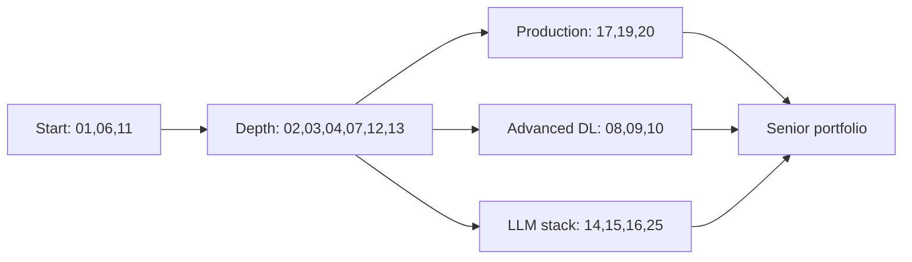

# 🧪 Practice Labs

A collection of standalone mini-projects focused on practice. Each lab is a finished artifact: data, code, metric, report. The goal — build muscle memory and assemble a portfolio you are not embarrassed to show in interviews.

## How to use

1. Pick a lab by level and topic.
2. Fork or create a new GitHub repository.
3. Follow the acceptance criteria — that is your definition of done.
4. Commit with a clean README, charts, and a final report.
5. Publish the link in your portfolio.

## Structure of every lab

- **Goal** — what we are building and why.
- **Dataset** — where to get it and how to load it.
- **Minimal pipeline** — what must work end-to-end.
- **Metrics and baseline** — numbers you may not fall below.
- **Extensions** — what to add for mid / advanced level.
- **Acceptance criteria** — a self-check checklist.
- **Anti-patterns** — common mistakes.

## Levels

| Level | Time | What you build |
|---|---|---|
| 🟢 Junior | 4–8 hours | Basic pipeline, problem understanding |
| 🟡 Middle | 1–3 days | Quality, validation, engineering |
| 🔴 Senior | 1–2 weeks | Production, monitoring, edge cases |

## Lab catalog

### Classical ML

- [Lab 01: Predict house prices (tabular)](./01-house-prices.md) 🟢
- [Lab 02: Customer churn with interpretability](./02-churn-shap.md) 🟡
- [Lab 03: Credit scoring under class imbalance](./03-credit-scoring.md) 🟡
- [Lab 04: Time-series demand forecasting](./04-demand-forecast.md) 🟡
- [Lab 05: Anomaly detection in logs](./05-anomaly-logs.md) 🔴

### Deep Learning and Computer Vision

- [Lab 06: Image classifier from scratch (PyTorch)](./06-image-classifier.md) 🟢
- [Lab 07: Fine-tune an object detector on your own dataset](./07-finetune-detector.md) 🟡
- [Lab 08: Semantic segmentation for medical imaging](./08-medical-segmentation.md) 🔴
- [Lab 09: Face anti-spoofing with FAR/FRR metrics](./09-face-antispoofing.md) 🔴
- [Lab 10: Real-time people tracker on video](./10-realtime-tracker.md) 🔴

### NLP and LLM

- [Lab 11: Sentiment classifier (HF transformers)](./11-sentiment-hf.md) 🟢
- [Lab 12: Named-entity recognition (NER) for documents](./12-ner-docs.md) 🟡
- [Lab 13: RAG over PDF with source citations](./13-rag-pdf.md) 🟡
- [Lab 14: LLM agent with tools and memory](./14-llm-agent.md) 🔴
- [Lab 15: Fine-tune Llama for a domain task (LoRA)](./15-llm-finetune.md) 🔴
- [Lab 16: Evaluation harness for an LLM (LLM-as-judge + golden set)](./16-llm-eval.md) 🔴

### MLOps and production

- [Lab 17: ML service on FastAPI + Docker + CI](./17-ml-service.md) 🟡
- [Lab 18: Feature store + retraining pipeline](./18-feature-store.md) 🔴
- [Lab 19: Model drift monitoring in production](./19-drift-monitoring.md) 🔴
- [Lab 20: End-to-end A/B test of an ML feature](./20-ab-test.md) 🔴

### Recommendations and search

- [Lab 21: Collaborative filtering on implicit feedback](./21-recsys-implicit.md) 🟡
- [Lab 22: Hybrid recsys with a two-tower model](./22-two-tower.md) 🔴
- [Lab 23: Semantic search with a reranker](./23-semantic-search.md) 🟡

### Speech and multimodality

- [Lab 24: Speech recognition (Whisper) + diarization](./24-asr-diarization.md) 🟡
- [Lab 25: Multimodal RAG (text + images)](./25-multimodal-rag.md) 🔴

## Suggested path

## General formatting rules

- README with sections: task, data, metrics, how to run, results, conclusions.
- Code split into modules: data/, models/, training/, inference/, tests/.
- Library versions pinned (requirements.txt or pyproject.toml).
- At least one unit test on a critical function.
- Training and metric charts saved in reports/.
- Final report: 1 page, numbers + 2–3 takeaways.

## Anti-patterns

- ❌ A Jupyter notebook with no structure or tests as the only artifact.
- ❌ Metric measured on the train set.
- ❌ No fixed random seed.
- ❌ README without a "how to reproduce" section.
- ❌ Huge images / datasets pushed into git.

---

[← Back to Roadmap](../README.md)
