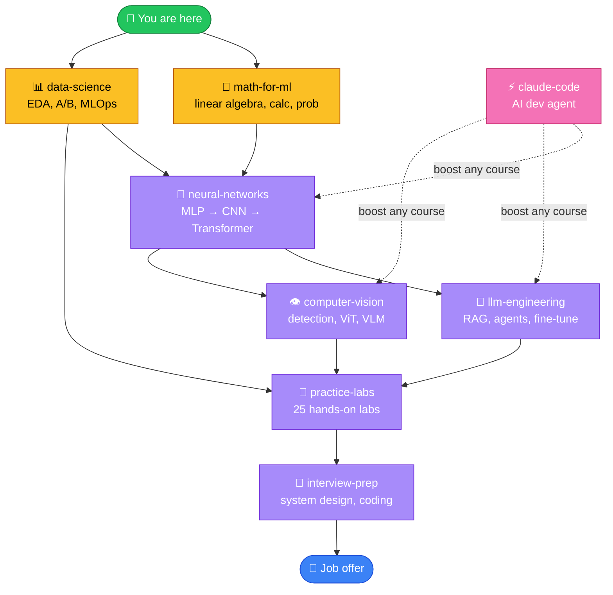
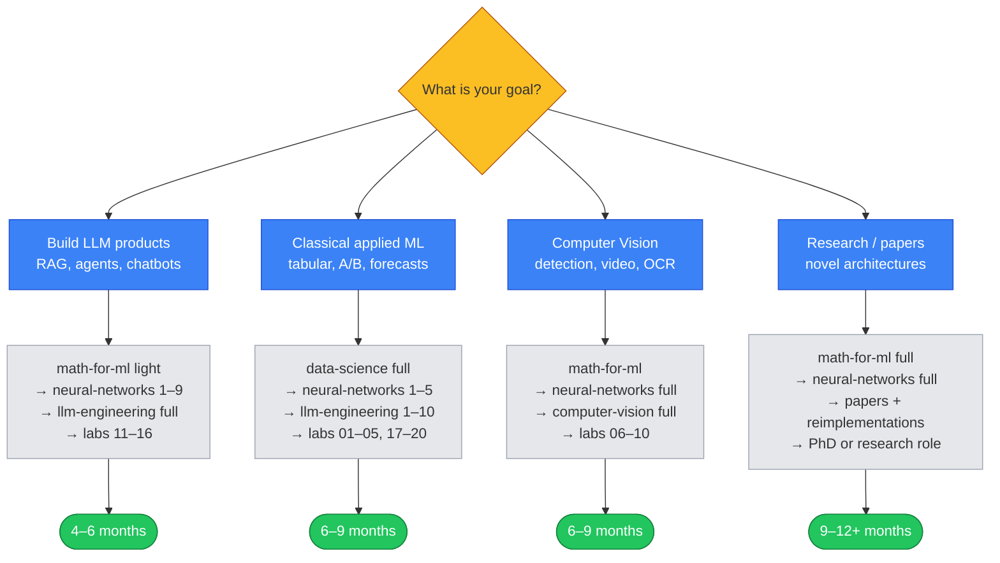
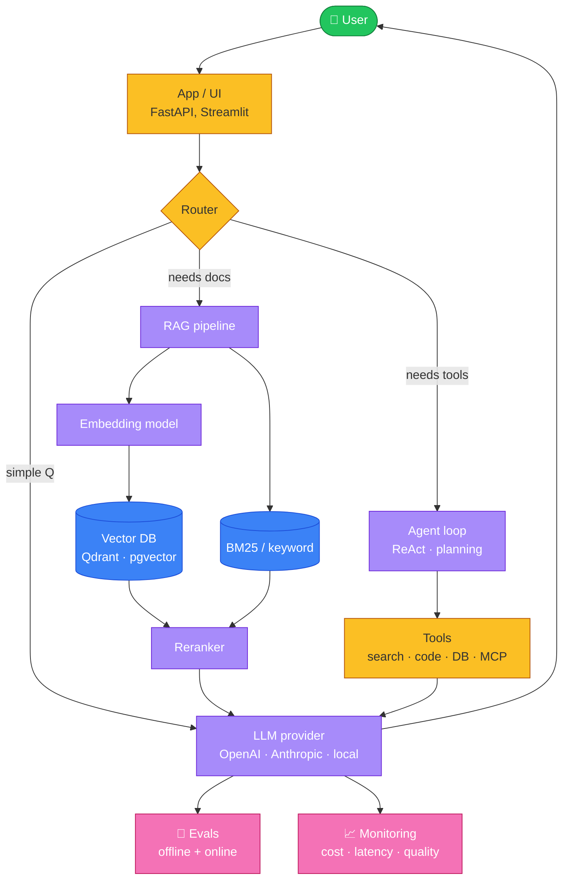
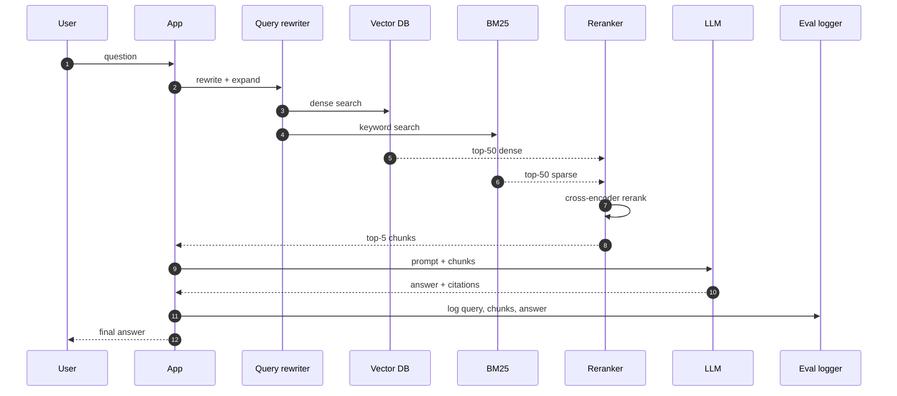
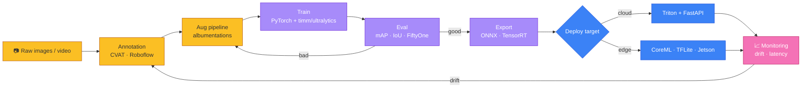
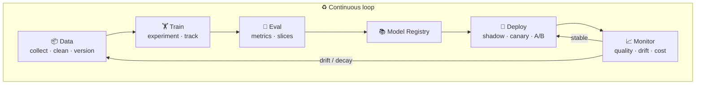
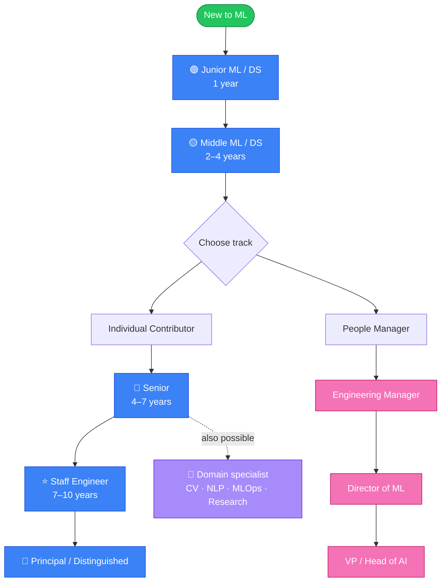
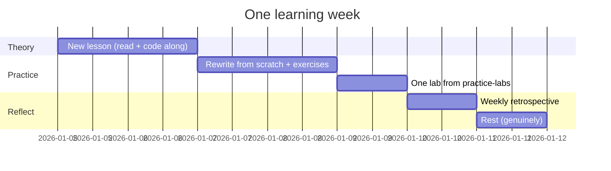

# 🗺️ Roadmap diagrams

Visual map of the whole repository. All diagrams use [Mermaid](https://mermaid.js.org/) — GitHub renders them natively.

If you only have 30 seconds, look at **Diagram 1** — it shows the entire learning path on one page.

---

## 1. Repository map: how the courses fit together



---

## 2. Pick a track (decision tree)



---

## 3. The neural-networks course at a glance

```mermaid
flowchart LR
    subgraph B1["Block 1 · Fundamentals"]
        L1[01 Perceptron] --> L2[02 MLP + backprop]
        L2 --> L3[03 Activations + init]
        L3 --> L4[04 Regularization]
        L4 --> L5[05 Optimizers]
    end

    subgraph B2["Block 2 · Architectures"]
        L6[06 CNN]
        L7[07 RNN/LSTM]
        L8[08 Attention]
        L9[09 Transformer]
        L6 --> L7 --> L8 --> L9
    end

    subgraph B3["Block 3 · Application"]
        L10[10 Embeddings + tokenization]
        L11[11 Fine-tuning]
        L12[12 Production]
        L10 --> L11 --> L12
    end

    subgraph B4["Block 4 · Advanced"]
        L13[13 ViT + multimodal]
        L14[14 Diffusion]
        L15[15 RLHF / DPO]
        L16[16 GNN]
        L17[17 Self-supervised]
        L18[18 Distributed training]
    end

    L5 --> L6
    L9 --> L10
    L12 --> L13
    L13 --> L14 --> L15 --> L16 --> L17 --> L18
```



---

## 4. LLM application stack (llm-engineering map)



---

## 5. RAG sequence: a single user query, step by step



---

## 6. Computer-vision production pipeline



---

## 7. MLOps lifecycle (data-science → production)



---

## 8. Career path



---

## 9. Weekly study cadence



---

## 10. Anti-patterns vs healthy patterns

```mermaid
flowchart LR
    subgraph Bad["🚫 Anti-patterns"]
        B1[Watch tutorials<br/>without coding]
        B2[Switch tracks<br/>every 2 weeks]
        B3[Track hours<br/>not artifacts]
        B4[Skip exercises<br/>"I get it already"]
        B5[Notebook-only<br/>no tests, no repo]
    end

    subgraph Good["✅ Healthy patterns"]
        G1[Code every lesson<br/>line by line]
        G2[Pick ONE track<br/>for 6+ weeks]
        G3[3 real projects<br/>on GitHub]
        G4[All exercises<br/>before next lesson]
        G5[Structured repo<br/>README + tests + report]
    end

    B1 --> G1
    B2 --> G2
    B3 --> G3
    B4 --> G4
    B5 --> G5

    classDef bad fill:#fca5a5,stroke:#991b1b
    classDef good fill:#86efac,stroke:#166534
    class B1,B2,B3,B4,B5 bad
    class G1,G2,G3,G4,G5 good
```

---

[← Back to main README](./README.md)
